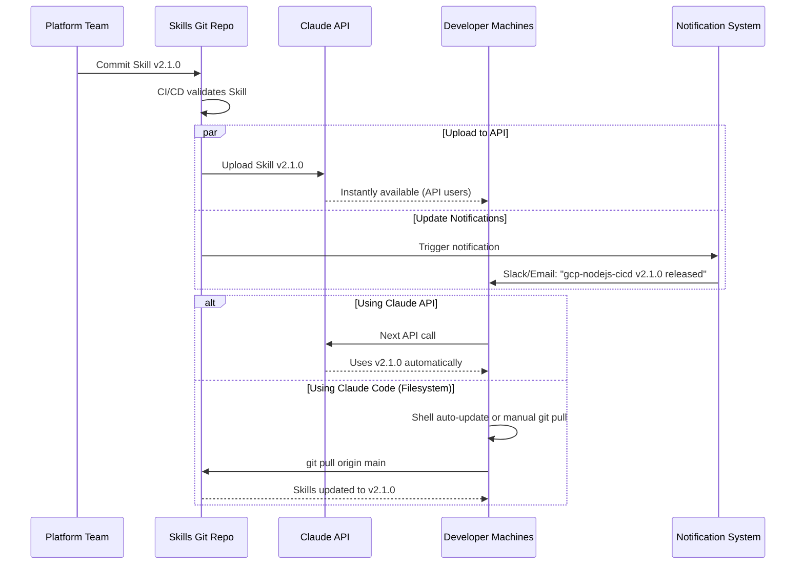
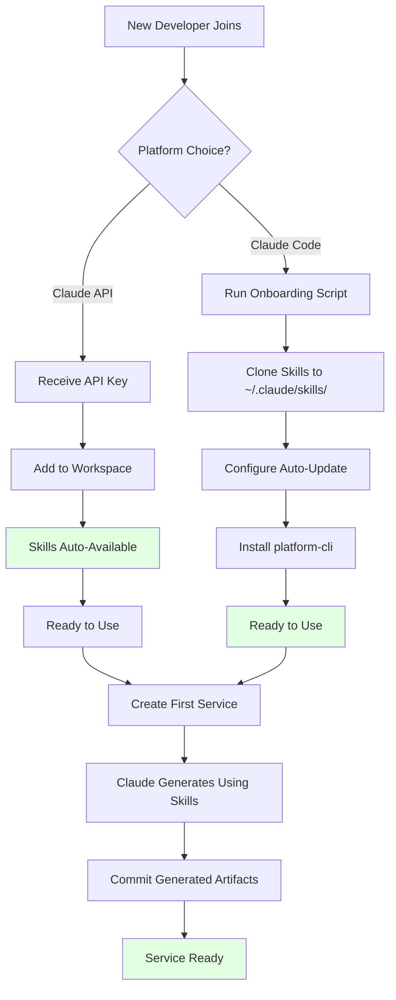
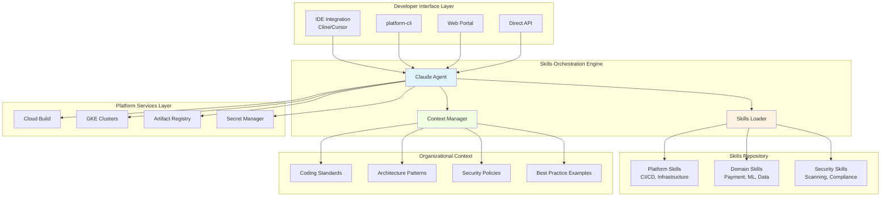
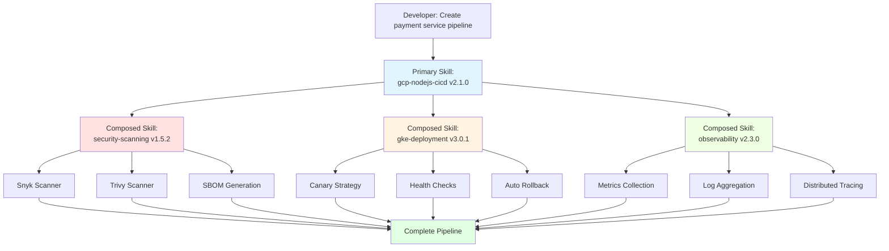
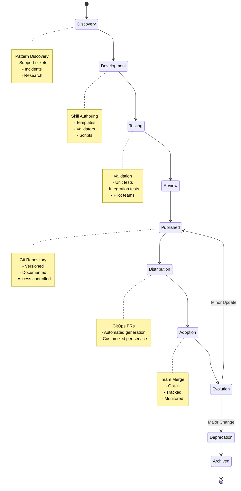
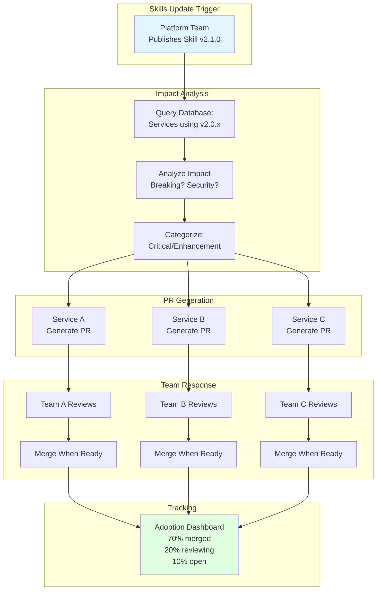
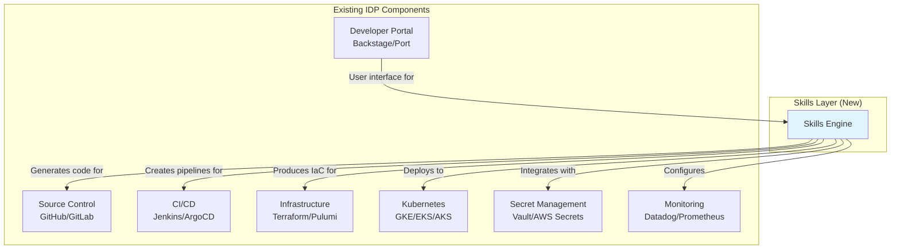

# Architecture: Conceptual Design & Patterns

> **The hybrid AI-deterministic architecture, Skills lifecycle, and integration patterns that make context-aware IDPs possible**

[← Previous: Vision](01-VISION.md) | [Back to Overview](README.md) | [Next: POC System Design →](03-POC-SYSTEM-DESIGN.md)

---

## Table of Contents

- [High-Level System Architecture](#high-level-system-architecture)
- [Hybrid AI-Deterministic Architecture](#hybrid-ai-deterministic-architecture)
- [Skills Composition Pattern](#skills-composition-pattern)
- [Skills Lifecycle & Operations](#skills-lifecycle--operations)
- [Developer Access Patterns](#developer-access-patterns)
- [Integration with Existing IDPs](#integration-with-existing-idps)

---

## Skills Technical Foundation

### Understanding Claude's Native Skills Implementation

Before diving into organizational architecture, it's critical to understand how Claude Skills actually work based on Anthropic's implementation.

#### Skills are Filesystem-Based Directories

From Anthropic's documentation: *"Skills are organized folders of instructions, scripts, and resources that agents can discover and load dynamically."*

A Skill is a directory containing a `SKILL.md` file with YAML frontmatter:

```
gcp-nodejs-cicd/
├── SKILL.md                    # Required: metadata + instructions
├── templates/
│   └── cloudbuild.yaml         # Optional: additional resources
├── validators/
│   └── security-policy.rego    # Optional: executable scripts
└── examples/
    └── payment-service/        # Optional: reference materials
```

#### Progressive Disclosure (Actual Token Counts)

Skills use a three-level progressive disclosure model:

**Level 1: Metadata (Always Loaded)**
- Content: YAML frontmatter (`name` and `description`)
- Token cost: ~100 tokens per Skill
- When loaded: At Claude startup, added to system prompt
- Purpose: Claude knows which Skills exist and when to use them

**Level 2: Instructions (Loaded When Triggered)**
- Content: Main body of SKILL.md
- Token cost: <5k tokens typically
- When loaded: When Claude determines Skill is relevant
- How loaded: Claude reads file via bash (`cat path/to/SKILL.md`)

**Level 3+: Resources & Code (Loaded As Needed)**
- Content: Additional files, scripts, templates, references
- Token cost: Effectively unlimited (not loaded into context)
- When accessed: As referenced by instructions or executed
- How accessed: Bash commands or code execution (output only in context)

#### Where Skills Actually Live

**Critical: Skills and service repositories are COMPLETELY SEPARATE.**

**Skills Location (Centralized):**

```
# Claude Code (Filesystem):
~/.claude/skills/
├── org-skills/                  # Organizational Skills
│   ├── gcp-nodejs-cicd/
│   │   └── SKILL.md
│   └── security-scanning/
│       └── SKILL.md

# Claude API (Server-side):
Uploaded to Anthropic's servers via /v1/skills API
Available workspace-wide

# Claude.ai (Per-user):
Uploaded as zip files via Settings > Features
```

**Service Repository (Only Generated Artifacts):**

```
~/projects/payment-api/          # Service repository
├── .cloudbuild/
│   └── cloudbuild.yaml          # Generated BY Skill
├── kubernetes/
│   └── deployment.yaml          # Generated BY Skill
├── .skills-metadata.json        # Tracks which Skills were used
└── src/                         # Application code

# NO SKILL.md files
# NO Skills directories
# ONLY outputs from Skills
```

**Key Insight:** Claude accesses Skills from their centralized location while working in the service repository. The filesystem-based VM environment allows Claude to read files from `~/.claude/skills/` while writing outputs to the current working directory.

---

## Skills Distribution & Bootstrap Mechanisms

### How Skills Get to Developers

Organizations must choose a distribution strategy based on their platform choices:

#### Distribution Model A: Claude API (Server-Based) - Recommended

**Initial Setup:**
```bash
# Platform team uploads Skills to Claude API
curl https://api.anthropic.com/v1/skills \
  -H "anthropic-beta: skills-2025-10-02" \
  -H "x-api-key: $CLAUDE_API_KEY" \
  -F "skill_file=@gcp-nodejs-cicd.zip"

# Skills immediately available workspace-wide
```

**Developer Usage:**
```python
# Developer creates new service
import anthropic

client = anthropic.Anthropic(api_key=os.getenv("CLAUDE_API_KEY"))

# Skills automatically available (no local setup needed)
response = client.messages.create(
    model="claude-3-5-sonnet-20241022",
    messages=[{"role": "user", "content": "Create CI/CD pipeline"}],
    tools=[{"type": "code_execution_2025-08-25"}],
    betas=["skills-2025-10-02"]
)
```

**Pros:**
- ✅ Zero developer maintenance
- ✅ Instant propagation of updates
- ✅ Always using latest approved version
- ✅ No local filesystem setup

**Cons:**
- ⚠️ Requires network access
- ⚠️ Depends on Anthropic's API availability

#### Distribution Model B: Claude Code (Filesystem-Based)

**Initial Setup:**
```bash
# Developer onboarding script
#!/bin/bash
# onboard-developer.sh

echo "Installing organizational Skills..."

# Clone Skills repository to standard location
git clone git@github.com:org/skills.git ~/.claude/skills/org-skills

# Configure auto-update (add to shell profile)
cat >> ~/.zshrc << 'EOF'
# Auto-update organizational Skills on terminal start
if [ -d ~/.claude/skills/org-skills ]; then
  (cd ~/.claude/skills/org-skills && git pull -q origin main 2>/dev/null &)
fi
EOF

echo "✓ Skills installed at ~/.claude/skills/org-skills"
echo "✓ Auto-update configured"
```

**Developer Usage:**
```bash
# Create new service
mkdir ~/projects/payment-api
cd ~/projects/payment-api
git init

# Open Claude Code
code .

# Claude automatically discovers Skills from ~/.claude/skills/
# No additional setup needed!
```

**Skills Update Strategies:**

**Strategy 1: Automated Git Pull (Passive)**
```bash
# Add to crontab (runs daily)
0 9 * * * cd ~/.claude/skills/org-skills && git pull origin main

# Or add to shell profile (runs on terminal open)
# Already shown in onboarding script above
```

**Strategy 2: platform-cli Integration (Active)**
```bash
# Developer manually checks and updates
$ platform-cli skills check
⚠️  Updates available:
  - gcp-nodejs-cicd: v2.0.0 → v2.1.0 (enhancement)
  - security-scanning: v1.5.0 → v1.5.2 (security fix)

$ platform-cli skills update
Updating Skills...
✓ gcp-nodejs-cicd updated to v2.1.0
✓ security-scanning updated to v1.5.2
```

**Strategy 3: IDE Extension Automation**
```json
// VS Code extension configuration
{
  "claude.skills.source": "git",
  "claude.skills.repository": "git@github.com:org/skills.git",
  "claude.skills.path": "~/.claude/skills/org-skills",
  "claude.skills.autoUpdate": true,
  "claude.skills.updateOn": "startup",  // or "daily" or "manual"
  "claude.skills.notifyUpdates": true
}
```

**Pros:**
- ✅ Works offline
- ✅ Full Git history and version control
- ✅ Developers can pin to specific versions
- ✅ Familiar Git workflow

**Cons:**
- ⚠️ Requires automation setup
- ⚠️ Developers must keep Skills updated
- ⚠️ Potential for outdated Skills

#### Distribution Model C: Hybrid (Best of Both)

**Strategy:**
```yaml
Production/Team Work:
  Primary: Claude API (server-based)
  - Zero maintenance for developers
  - Always current

Personal/Offline Work:
  Fallback: Filesystem Skills
  - Available offline
  - Can experiment with Skill changes
```

**Configuration:**
```python
# platform-cli automatically handles distribution
# Uses API when available, filesystem as fallback
client = get_claude_client(
    prefer="api",      # Try API first
    fallback="filesystem"  # Use local if API unavailable
)
```

---

### Skills Update Lifecycle

#### When Platform Team Updates a Skill



#### Ensuring Developer Skills are Current

**Monitoring & Compliance:**

```bash
# Platform team can check Skills versions in use
platform-cli audit skills-versions

Output:
Developer Skill Versions:
├── jane@company.com
│   ├── gcp-nodejs-cicd: v2.1.0 ✓ (current)
│   └── security-scanning: v1.5.2 ✓ (current)
├── john@company.com
│   ├── gcp-nodejs-cicd: v2.0.0 ⚠️ (outdated)
│   └── security-scanning: v1.5.0 ⚠️ (security update available)
└── alice@company.com
│   └── Using Claude API ✓ (always current)

Action Required:
- Notify john@company.com to update Skills
- Security-critical update available for 2 developers
```

**Enforcement Options:**

**Option 1: Soft Enforcement (Notifications)**
```bash
# Platform sends reminders
./notify-outdated-skills.sh

# Developers receive:
"Your gcp-nodejs-cicd Skill is outdated (v2.0.0).
Update recommended: cd ~/.claude/skills/org-skills && git pull"
```

**Option 2: Hard Enforcement (Validation)**
```bash
# In generated pipelines, add version check
if [ "$(get-skill-version)" != "2.1.0" ]; then
  echo "ERROR: This pipeline requires gcp-nodejs-cicd v2.1.0+"
  echo "Update: cd ~/.claude/skills/org-skills && git pull"
  exit 1
fi
```

**Option 3: Migration to API (Eliminate Problem)**
```bash
# Recommended long-term
# Migrate developers from filesystem to API
# Zero maintenance, always current
```

---

### Bootstrap Flow for New Developers

**Developer Onboarding Journey:**



---

## 🎯 Recommended Approach for Organizations

**Primary: Claude API Distribution**
- Upload Skills via `/v1/skills` API
- Zero developer maintenance
- Instant updates
- Workspace-wide availability

**Secondary: Filesystem for Power Users**
- Clone to `~/.claude/skills/` for offline work
- Automated updates via Git hooks
- Flexibility for experimentation

**Monitoring: Platform Visibility**
- Track which developers use which Skill versions
- Alert on outdated Skills (especially security updates)
- Provide easy update mechanisms

**The key principle:** Skills are infrastructure, managed centrally, accessed from anywhere. Service repos contain only the outputs, never the Skills themselves.

---

## High-Level System Architecture

The Skills-enabled IDP architecture follows a layered design that integrates with existing platform components while adding intelligent orchestration.



### Key Architectural Layers

#### 1. Developer Interface Layer
Multiple access patterns support different workflows:
- **IDE Integration**: Primary development workflow (Cline, Cursor)
- **CLI**: Automation and scripting (platform-cli)
- **Web Portal**: Discovery and exploration (Backstage or custom)
- **Direct API**: Programmatic integration for custom tools

#### 2. Skills Orchestration Engine
The intelligence layer that:
- Understands developer intent through natural language
- Loads relevant Skills dynamically (progressive disclosure)
- Manages organizational context
- Coordinates between AI reasoning and deterministic execution

#### 3. Skills Repository
Modular, versioned packages organized by ownership:
- **Platform Skills**: Owned by platform team (CI/CD, infrastructure)
- **Domain Skills**: Owned by domain teams (payments, ML, data)
- **Security Skills**: Owned by security team (scanning, compliance)

#### 4. Organizational Context
Codified knowledge that informs AI decisions:
- Coding standards and style guides
- Proven architectural patterns
- Security and compliance policies
- Examples from your best repositories

#### 5. Platform Services Layer
Existing IDP components that Skills integrate with:
- CI/CD systems (Cloud Build, GitHub Actions, Jenkins)
- Container orchestration (Kubernetes, GKE)
- Artifact storage (registries)
- Secrets management

---

## Hybrid AI-Deterministic Architecture

The breakthrough innovation of Skills is combining probabilistic AI reasoning with deterministic code execution.

```mermaid
flowchart LR
    subgraph "Probabilistic AI Layer"
        Intent[Understand Intent]
        Analyze[Analyze Context]
        Select[Select Patterns]
        Parameterize[Parameterize Solution]
    end
    
    subgraph "Deterministic Code Layer"
        Templates[Validated Templates]
        Validators[Policy Validators]
        Scripts[Automation Scripts]
        Scanners[Security Scanners]
    end
    
    subgraph "Output"
        Pipeline[Production-Ready Pipeline]
        Compliant[Compliance Guaranteed]
        Auditable[Fully Auditable]
    end
    
    Request[Developer Request] --> Intent
    Intent --> Analyze
    Analyze --> Select
    Select --> Parameterize
    
    Parameterize --> Templates
    Templates --> Validators
    Validators --> Scripts
    Scripts --> Scanners
    
    Scanners --> Pipeline
    Pipeline --> Compliant
    Compliant --> Auditable
    
    style Request fill:#e1f5ff
    style Intent fill:#e1f5ff
    style Analyze fill:#e1f5ff
    style Select fill:#e1f5ff
    style Parameterize fill:#e1f5ff
    style Templates fill:#ffe1e1
    style Validators fill:#ffe1e1
    style Scripts fill:#ffe1e1
    style Scanners fill:#ffe1e1
    style Pipeline fill:#e1ffe1
    style Compliant fill:#e1ffe1
    style Auditable fill:#e1ffe1
```



### The Critical Balance

#### Probabilistic Layer (AI Reasoning)

**What AI Does:**
- Understands developer intent from natural language
- Analyzes service context (language, dependencies, architecture)
- Selects appropriate patterns from organizational knowledge
- Generates service-specific parameterization

**Example:**
```
Developer: "I need a pipeline for my payment API"

AI Reasoning:
✓ Understands: payment service = high security requirements
✓ Infers: likely needs PCI-compliant patterns
✓ Considers: organization's standard Node.js build process
✓ Suggests: appropriate testing strategies
```

#### Deterministic Layer (Executable Code)

**What Deterministic Code Does:**
- Validates against security policies (Policy-as-Code)
- Enforces compliance requirements (SOC2, HIPAA, PCI)
- Executes proven deployment strategies (blue-green, canary)
- Runs security scans with defined thresholds

**Example:**
```
Deterministic Execution:
✓ Enforces: mandatory Snyk scan with 0 critical vulnerabilities
✓ Validates: secrets stored in Secret Manager, not code
✓ Ensures: production deployments require approval
✓ Guarantees: rollback procedures are included
```

### Why This Matters

**Output Characteristics:**
- **Feels custom-generated** - AI adapts to specific context
- **Provably compliant** - Deterministic validation ensures standards
- **Fully auditable** - Every decision and validation logged
- **Reliably reproducible** - Critical operations execute identically

This hybrid approach makes Skills fundamentally different from pure AI code generation. Platform teams can confidently include Skills capabilities in their offerings because:
- Security policies are enforced deterministically
- Compliance validations run consistently
- Deployment procedures execute reliably
- All while developers experience natural language flexibility

---

## Skills Composition Pattern

Skills work together seamlessly to handle complex scenarios, combining different types of expertise.



### Compositional Benefits

#### Separation of Concerns
- **Security team** owns security-scanning Skill
- **Platform team** owns deployment Skill
- **SRE team** owns observability Skill
- Each team maintains their domain independently

#### Independent Evolution
- Skills update independently without breaking others
- Version compatibility managed explicitly
- Backward compatibility maintained per Skill

#### Team Autonomy
- Domain teams can add domain-specific Skills
- No central bottleneck for all patterns
- Organizational knowledge distributed appropriately

#### Organizational Learning
- Successful patterns automatically become part of Skills
- Best practices propagate across teams
- Institutional knowledge preserved and improved

### Example: Complete Pipeline from Composed Skills

```
Request: "Create CI/CD pipeline for payment-api service"

Skills Engine Analyzes:
├── Primary: gcp-nodejs-cicd (Node.js build patterns)
├── Security: security-scanning (PCI compliance for payment data)
├── Deployment: gke-deployment (canary for high-risk service)
└── Observability: gcp-observability (enhanced monitoring for payments)

Generated Pipeline Includes:
├── Build: Multi-stage Docker with approved base image
├── Test: Unit + integration tests with coverage reporting
├── Security: Snyk + Trivy + SBOM + custom PCI validators
├── Deploy: Canary rollout with traffic splitting
├── Monitor: Payment-specific metrics + distributed tracing
└── Rollback: Automated rollback on error rate threshold

Result: Production-ready pipeline in 15 minutes
```

---

## Skills Lifecycle & Operations

Skills are living products that evolve with organizational needs. Understanding their lifecycle is critical for platform teams.



### Creating New Skills: Discovery to Production

#### Discovery Phase

**Pattern Discovery Sources:**
- **Support Tickets**: High-volume, repetitive questions indicate knowledge gaps
  - Example: "How do I set up canary deployments?" (50+ tickets/month)
  - Solution: Create deployment-strategies Skill

- **Code Review Patterns**: Recurring violations indicate missing guidance
  - Example: Secrets in code (20+ violations/week)
  - Solution: Enhance security-scanning Skill with secret detection

- **Production Incidents**: Post-mortems reveal missing safeguards
  - Example: 5 incidents from missing health checks
  - Solution: Update kubernetes-deployment Skill with health check templates

- **New Technology Adoption**: Organization adopts new tool/framework
  - Example: Migrating from REST to gRPC
  - Solution: Create grpc-service-generation Skill

#### Development Phase

**Skill Development Workflow:**

1. **Requirements Gathering**
   - Interview platform team (tribal knowledge)
   - Analyze existing implementations (code archaeology)
   - Review industry best practices (external research)
   - Define success criteria (measurable outcomes)

2. **Skill Authoring**
   - Create skill.json (metadata)
   - Write instructions.md (AI guidance)
   - Develop templates/ (deterministic code)
   - Build validators/ (policy-as-code)
   - Create scripts/ (automation utilities)
   - Add examples/ (reference implementations)

3. **Testing & Validation**
   - Unit tests for validators and scripts
   - Integration tests with real services
   - Security review by security team
   - Compliance validation against policies
   - User acceptance testing with pilot teams

4. **Documentation**
   - README with usage instructions
   - Architectural decision record (why this Skill exists)
   - Examples for common use cases
   - Troubleshooting guide

5. **Review & Approval**
   - Platform team technical review
   - Security team approval (for security-related Skills)
   - Domain team validation (for domain-specific Skills)
   - Final sign-off from Platform Engineering Lead

### Skills Versioning Strategy

Skills follow semantic versioning (MAJOR.MINOR.PATCH) with clear upgrade paths.

```
Version Format: MAJOR.MINOR.PATCH

PATCH (1.0.0 → 1.0.1):
├── Bug fixes in validators or scripts
├── Documentation improvements
├── Performance optimizations
└── No breaking changes, auto-update safe

MINOR (1.0.1 → 1.1.0):
├── New features added (e.g., additional deployment strategy)
├── New templates for additional use cases
├── Enhanced organizational context
└── Backward compatible, opt-in update

MAJOR (1.1.0 → 2.0.0):
├── Breaking changes to templates or APIs
├── Removal of deprecated features
├── Fundamental approach changes
└── Requires explicit migration, no auto-update
```

### GitOps-Based Update Distribution

When a Skill is updated, the platform generates Pull Requests to affected repositories. **Product teams own their services and opt-in to updates by merging PRs.**



### Skills Update Categories

#### Category 1: Security-Critical Updates (PATCH with CVE fixes)

**Platform Behavior:**
- Generate PRs to all affected services
- Mark as "security-critical" with 🔴 label
- Notify security team + service owners
- Track adoption in security dashboard
- Platform team follows up with teams that haven't merged within 1 week

**Team Response:**
- Review PR (typically <10 minutes)
- Merge to staging, validate
- Merge to production within SLA (e.g., 72 hours for critical)

#### Category 2: Feature Enhancements (MINOR releases)

**Platform Behavior:**
- Generate PRs with opt-in instructions
- Mark as "enhancement" with 🟢 label
- Include adoption guide and benefits
- Track adoption (informational only)
- No follow-up - teams adopt when beneficial

**Team Response:**
- Review PR at convenience
- Evaluate value for their service
- Merge if beneficial
- Decline/close PR if not needed (perfectly acceptable)

#### Category 3: Breaking Changes (MAJOR releases)

**Platform Behavior:**
- Generate PRs with comprehensive migration guide
- Mark as "breaking-change" with 🟡 label
- Include 6-month deprecation timeline
- Provide backward compatibility shim (if possible)
- Offer migration support from platform team
- Track adoption with staged deadline

**Team Response:**
- Plan migration within deprecation timeline
- Test thoroughly in dev/staging
- Request platform team assistance if needed
- Merge before deadline
- Emergency extension available if justified

---

## Developer Access Patterns

Skills-based platforms meet developers where they work, supporting multiple access patterns suited to different workflows.

### Access Pattern 1: IDE-First (Primary Development)

**Cline Extension in VS Code/Cursor:**

```
Developer Workflow:
1. Open project in VS Code
2. Cline extension auto-detects service type
3. Cline loads relevant Skills automatically
4. Developer: "Add a deployment pipeline for this service"
5. Cline (with Skills):
   ├── Analyzes codebase context
   ├── Loads gcp-nodejs-cicd Skill
   ├── Asks clarifying questions
   ├── Generates complete pipeline
   └── Validates against policies
6. Developer reviews in IDE, approves
7. Files written to repository
8. Developer commits and pushes

Benefits:
├── No context switching (stay in IDE)
├── Real-time validation
├── Integrated with code editing
└── Git workflow native
```

### Access Pattern 2: Terminal-First (Automation)

**platform-cli Utility:**

```bash
# Generate pipeline for service
$ platform-cli generate pipeline \
    --service payment-api \
    --target gke \
    --environments dev,staging,prod \
    --deployment-strategy canary

# Validate existing pipeline
$ platform-cli validate pipeline \
    --path .cloudbuild/cloudbuild.yaml

# List available Skills
$ platform-cli skills list --filter nodejs

# Update service to latest Skill version
$ platform-cli skills update --auto-merge-dev

# Batch operations
$ platform-cli batch-update \
    --skill gcp-nodejs-cicd \
    --version 2.1.0 \
    --services @services.txt \
    --dry-run
```

**Benefits:**
- Scriptable for automation
- CI/CD integration
- Batch operations support
- Pipeline-as-code workflows

### Access Pattern 3: Portal-First (Discovery)

**IDP Web Portal (Backstage or custom):**

```
Portal Workflow:
1. Navigate to portal.company.com
2. Click "New Service" or "Generate Pipeline"
3. Conversational wizard appears
4. Provide natural language or guided prompts
5. Skills Engine generates options with AI
6. Preview generated artifacts
7. Approve and commit to repository

Benefits:
├── Visual feedback and previews
├── Discovery of platform capabilities
├── Good for infrequent tasks
└── Effective for onboarding
```

### Access Pattern 4: API-First (Programmatic)

**Direct API Integration:**

```python
# Python SDK example
from skills_platform import SkillsClient

client = SkillsClient(api_key=os.getenv('SKILLS_API_KEY'))

# Generate pipeline programmatically
pipeline = client.pipelines.generate(
    intent="Create CI/CD pipeline for Node.js payment service",
    context={
        "repository": "github.com/company/payment-api",
        "language": "nodejs",
        "deployment_target": "gke"
    }
)

# Validate before commit
validation = client.validate(pipeline.artifacts['cloudbuild_yaml'])
if validation.passed:
    with open('.cloudbuild/cloudbuild.yaml', 'w') as f:
        f.write(pipeline.artifacts['cloudbuild_yaml'])
```

**Benefits:**
- Custom tooling integration
- Automated workflows
- Programmatic control
- Third-party tool integrations

### Access Pattern Comparison

| Access Pattern | Best For | Learning Curve | Automation | Flexibility |
|----------------|----------|----------------|------------|-------------|
| **IDE-First** | Daily development | Low | Medium | High |
| **Terminal** | Power users, scripts | Medium | High | High |
| **Portal** | Exploration, training | Very Low | Low | Medium |
| **API** | Custom tools | High | Very High | Very High |

**Recommendation:** Support all patterns. Most organizations see 60% IDE, 25% CLI, 10% Portal, 5% API usage.

---

## Integration with Existing IDPs

Skills don't replace existing IDP components—they augment them with intelligent orchestration.

### Integration Architecture



### Integration Patterns

#### Pattern 1: Generation Layer

**What Skills Do:** Generate artifacts that existing tools consume
- **Terraform/Pulumi code** → Existing IaC workflows execute it
- **Cloud Build YAML** → Cloud Build executes the pipeline
- **Kubernetes manifests** → kubectl/ArgoCD deploys them

**Benefit:** Zero disruption to existing deployment infrastructure

#### Pattern 2: Policy Enforcement

**What Skills Do:** Add intelligent policy validation before execution
- Pre-validate Terraform plans against OPA policies
- Check pipeline configurations before commit
- Verify Kubernetes manifests against security policies

**Benefit:** Shift-left compliance without changing deployment tools

#### Pattern 3: Context Enrichment

**What Skills Do:** Add organizational context to existing workflows
- Enhance Backstage templates with Skills-generated scaffolding
- Augment Jenkins shared libraries with Skills patterns
- Provide context-aware assistance in existing portals

**Benefit:** Gradual enhancement of existing investments

---

## Key Architectural Principles

### 1. Layered Abstraction
Each layer has clear responsibilities and interfaces, enabling independent evolution and maintenance.

### 2. Progressive Disclosure
Skills metadata is loaded cheaply upfront. Full content loads only when relevant to the task.

### 3. Composability
Multiple Skills can work together seamlessly, combining different types of organizational knowledge.

### 4. Versioning & Governance
Skills are versioned artifacts with clear ownership, review processes, and access controls.

### 5. Integration, Not Replacement
Skills enhance existing IDP components rather than replacing them, ensuring incremental adoption.

### 6. Feedback Loops
Continuous measurement of effectiveness drives Skill improvement and platform evolution.

---

## Summary

The Skills-enabled IDP architecture provides:

✅ **Hybrid AI-deterministic execution** - Flexible yet reliable
✅ **Compositional Skills** - Modular, maintainable organizational knowledge
✅ **GitOps-based distribution** - Teams retain control and autonomy
✅ **Multiple access patterns** - Meet developers where they work
✅ **Seamless integration** - Augment existing platforms incrementally

This architecture makes it possible to embed organizational expertise at scale while maintaining the reliability, security, and auditability that platform teams require.

---

**Ready for detailed technical specifications?** Continue to [03-POC-SYSTEM-DESIGN.md](03-POC-SYSTEM-DESIGN.md) →

[← Previous: Vision](01-VISION.md) | [Back to Overview](README.md) | [Next: POC System Design →](03-POC-SYSTEM-DESIGN.md)
