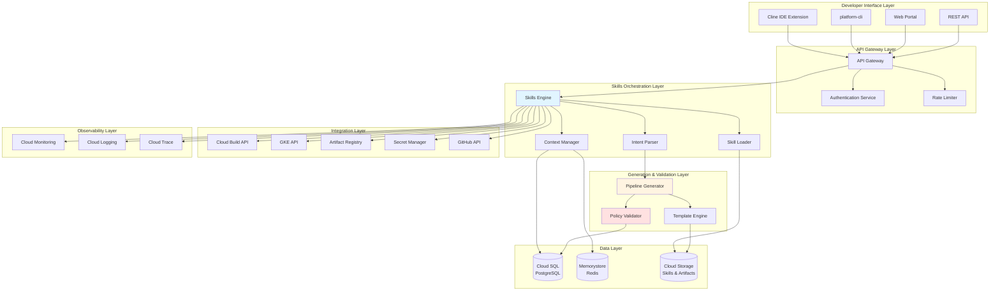
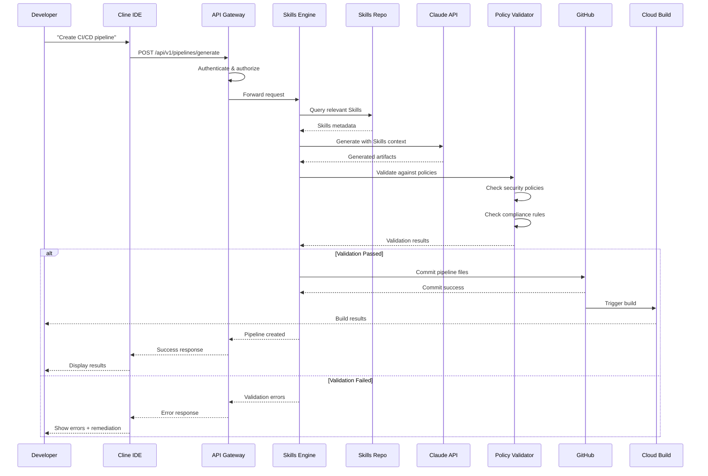
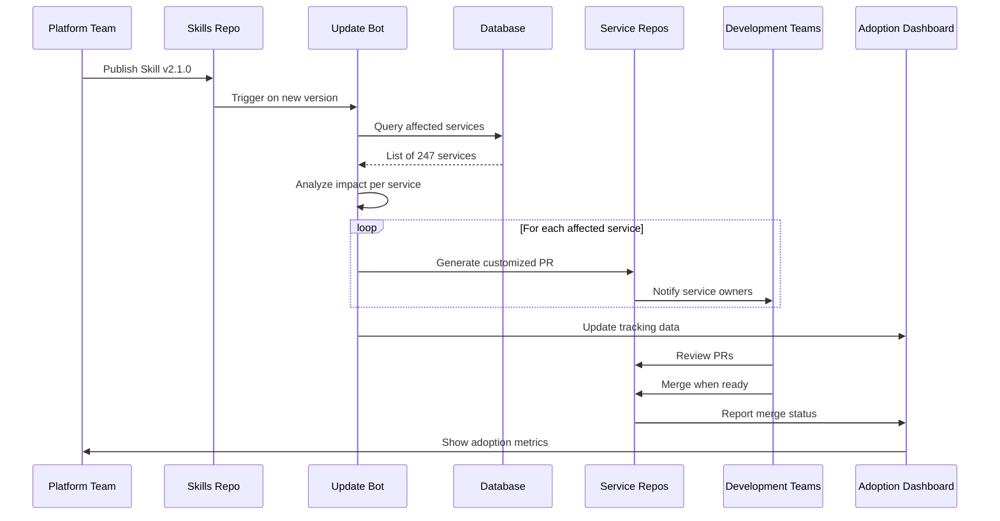
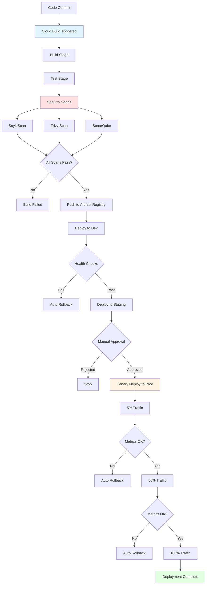

# POC System Design: Technical Blueprint

> **Detailed functional requirements, system architecture, API design, and data models for building a Skills-enabled CI/CD platform**

[← Previous: Architecture](02-ARCHITECTURE.md) | [Back to Overview](README.md) | [Next: Implementation Guide →](04-IMPLEMENTATION-GUIDE.md)

---

## Table of Contents

- [POC Overview & Scope](#poc-overview--scope)
- [Current CI/CD Paradigms Analysis](#current-cicd-paradigms-analysis)
- [Functional Requirements](#functional-requirements)
- [Non-Functional Requirements](#non-functional-requirements)
- [System Architecture](#system-architecture)
- [Data Flow Architecture](#data-flow-architecture)
- [API Design](#api-design)
- [Data Models](#data-models)
- [Skills Structure](#skills-structure)
- [GCP Integration](#gcp-integration)
- [Security & Observability](#security--observability)

---

## POC Overview & Scope

This proof-of-concept demonstrates the first Skills-based capability for Internal Developer Platforms: **intelligent CI/CD pipeline generation**. The POC focuses on modern cloud-native application delivery patterns while providing a migration path from existing pipeline paradigms.

### Technology Stack

**Application Frameworks:**
- Node.js (Express, NestJS)
- Angular (SPA/SSR)

**Cloud Platform:**
- Google Cloud Platform
- Cloud Build (CI/CD)
- GKE (Container Orchestration)
- Artifact Registry (Container Images)
- Secret Manager (Secrets)

**Developer Interfaces:**
- Cline VS Code extension (with Claude Skills)
- platform-cli utility
- IDP web portal
- API integrations

**CI/CD Platform:**
- Cloud Build with GitHub Actions integration capability

**Security Scanning:**
- Snyk (dependencies)
- Trivy (containers)
- SonarQube (code quality)

### Language Landscape Context

While this POC targets TypeScript/JavaScript workloads (representing ~65% of modern software development), the Skills architecture is designed to be **language-agnostic**.

**Most Prevalent Languages:**
- **TypeScript/JavaScript (65%)**: Web frontends, Node.js backends, full-stack
- **Java (45%)**: Enterprise backends, Spring Boot, Android
- **Python (35%)**: ML/AI workloads, data processing, FastAPI
- **Go (25%)**: Cloud-native services, infrastructure tools
- **C#/.NET (20%)**: Enterprise applications, Azure-centric orgs

The Node.js/Angular focus provides representative patterns for the majority case while enabling straightforward extension to other languages.

---

## Current CI/CD Paradigms Analysis

Before designing the Skills-based solution, we must understand why existing approaches fall short and how to migrate from them.

### Paradigm 1: Template-Based Pipelines

**The Spotify/Netflix Model:**

```
Centralized Template Repository
├── base-pipeline.yaml (foundational template)
├── node-service.yaml (extends base)
├── angular-app.yaml (extends base)
├── python-service.yaml (extends base)
└── 100+ specialized variants...

Developer Workflow:
1. Copy template to new repository
2. Search/replace placeholders
3. Customize for specific needs
4. Pipeline often works initially...
5. ...but diverges over time
```

**Problems:**
- **Template Explosion**: 100+ template variants, each slightly different
- **Maintenance Nightmare**: Security updates require manually updating every repository
- **Drift Over Time**: Teams customize templates, creating snowflakes
- **No Enforcement**: Can't mandate adoption of updated practices
- **Knowledge Silos**: Why certain patterns exist is lost

### Paradigm 2: Pipeline-as-Code Libraries

**Jenkins Shared Libraries / GitHub Reusable Workflows:**

```
shared-pipeline-library/
├── vars/
│   ├── buildNodeService.groovy
│   ├── deployToGKE.groovy
│   └── 50+ more functions...
└── resources/
    └── templates and configs

Developer Pipeline:
@Library('shared-pipeline@v2.4.1') _
buildNodeService(
  service: 'payment-api',
  nodeVersion: '20'
)
```

**Problems:**
- **Version Hell**: Teams pin to different library versions
- **Breaking Changes**: Updating library breaks 40% of pipelines
- **Cognitive Load**: Developers need deep understanding of library DSL
- **Poor Discoverability**: Which function? What parameters?
- **Debugging Complexity**: Errors deep in library code are opaque

### Paradigm 3: Golden Path / Paved Road

**Backstage Software Templates:**

```
Service Creation Form:
[Service Name: _____________]
[Owner Team: ▼ Select Team]
[Programming Language: ▼ Node.js]
... 40 more fields ...
[Generate Service]

Result:
✓ Repository created
✓ Pipeline added
BUT... developer immediately needs to customize
```

**Problems:**
- **Form Overload**: 40+ fields = decision fatigue
- **Rigid Abstraction**: Works for 80%, terrible for 20%
- **False Completeness**: Pipeline exists but doesn't match needs
- **Post-Generation Drift**: Developers customize, losing benefits

### The Paradigm Shift: Skills-Based Approach

**Old Paradigm → Skills-Based Paradigm**

| Aspect | Traditional | Skills-Based |
|--------|-------------|--------------|
| **Knowledge Storage** | Templates, docs, tribal knowledge | Executable Skills with context |
| **Customization** | Manual editing, copy-paste | AI-guided generation with guardrails |
| **Updates** | Manual propagation, breaking changes | Skill versioning, backward compatibility |
| **Learning Curve** | Read docs, ask seniors, trial-error | Conversational interface, natural language |
| **Compliance** | Post-hoc checking, review gates | Built-in validation, policy-as-code |
| **Discoverability** | Search docs, browse templates | AI suggests relevant patterns |

**Key Insight:** Skills don't replace CI/CD platforms—they augment them with intelligent generation and organizational context.

---

## Functional Requirements

### FR1: Natural Language Pipeline Generation

**Description:** Accept developer intent in conversational form and generate complete CI/CD configurations.

**Capabilities:**
- Parse natural language requests ("Create a pipeline for my Node.js service")
- Ask follow-up questions for clarification
- Generate complete Cloud Build YAML configuration
- Provide explanation of design decisions
- Support iterative refinement

**Example Interaction:**
```
Developer: "I need a CI/CD pipeline for my payment API"

Claude: "I'll create a pipeline for your payment service. A few questions:
1. What Node.js version? (I see package.json specifies 20.x)
2. Do you need canary deployment for production? (Recommended for payment services)
3. Any specific compliance requirements? (PCI-DSS typically applies to payment processing)"

Developer: "Yes to canary, yes we're PCI compliant"

Claude: "Generating pipeline with:
- Node.js 20.x build
- Enhanced security scanning for PCI compliance
- Canary deployment strategy
- Required approval gates for production
..."
```

### FR2: Organizational Standards Enforcement

**Description:** Automatically embed organizational standards into generated pipelines.

**Enforced Standards:**
- **Security Scans**: Mandatory Snyk, Trivy, SonarQube scans
- **Quality Gates**: Test coverage thresholds, linting rules
- **Compliance Validations**: SOC2, PCI checks where applicable
- **Naming Conventions**: GCP resource naming standards
- **Tagging Standards**: Cost allocation, ownership tags

**Validation Points:**
- Pre-generation validation (before creating pipeline)
- Pre-commit validation (before Git commit)
- Runtime validation (during pipeline execution)

### FR3: Multi-Environment Deployment

**Description:** Support standard dev → staging → production promotion flows.

**Environment Configurations:**
```yaml
environments:
  dev:
    auto_deploy: true
    approval_required: false
    gke_cluster: "dev-cluster"
    namespace: "payments-dev"
    
  staging:
    auto_deploy: false
    approval_required: true
    approvers: ["team-lead"]
    gke_cluster: "staging-cluster"
    namespace: "payments-staging"
    
  production:
    auto_deploy: false
    approval_required: true
    approvers: ["team-lead", "platform-lead"]
    deployment_strategy: "canary"
    gke_cluster: "prod-cluster"
    namespace: "payments-prod"
```

**Capabilities:**
- Environment-specific configurations
- Progressive rollout strategies
- Approval gates for production
- Environment promotion tracking

### FR4: Security Integration

**Description:** Integrated security scanning with configurable thresholds.

**Security Components:**
```
Dependency Scanning (Snyk):
├── Scan package.json dependencies
├── Fail on critical vulnerabilities
├── Generate SBOM (Software Bill of Materials)
└── Upload results to security dashboard

Container Scanning (Trivy):
├── Scan Docker images for CVEs
├── Check for secrets in container layers
├── Validate base image compliance
└── Fail on high/critical vulnerabilities

Code Quality (SonarQube):
├── SAST (Static Application Security Testing)
├── Code coverage analysis
├── Security hotspot detection
└── Technical debt measurement
```

**Thresholds (Configurable):**
- Critical vulnerabilities: 0 allowed
- High vulnerabilities: 5 allowed with justification
- Code coverage: 80% minimum
- Security rating: A or B required

### FR5: GKE Deployment Automation

**Description:** Generate complete Kubernetes deployment configurations.

**Generated Artifacts:**
```
kubernetes/
├── deployment.yaml
│   ├── Container specifications
│   ├── Resource limits (CPU, memory)
│   ├── Health checks (liveness, readiness)
│   └── Environment variables
├── service.yaml
│   ├── ClusterIP for internal services
│   └── LoadBalancer for external services
├── hpa.yaml (Horizontal Pod Autoscaler)
│   ├── Min/max replicas
│   └── CPU/memory targets
└── ingress.yaml (if external)
    ├── TLS configuration
    └── Routing rules
```

**Deployment Strategies:**
- **Rolling Update**: Default for most services
- **Blue-Green**: Zero-downtime with instant rollback
- **Canary**: Progressive traffic shifting (5% → 50% → 100%)

### FR6: Rollback and Recovery

**Description:** Automated and manual rollback capabilities.

**Capabilities:**
- **Automatic Rollback**: On failed health checks or error rate spike
- **Manual Rollback**: Via CLI command or portal UI
- **State Preservation**: Previous deployment states saved
- **Incident Response**: Runbooks generated with each deployment

**Rollback Triggers:**
```yaml
rollback_conditions:
  health_check_failures: 3
  error_rate_threshold: 5%
  response_time_p99: 2000ms
  manual_trigger: true
```

### FR7: Pipeline Validation

**Description:** Multi-stage validation before and during execution.

**Validation Stages:**
```
Pre-Commit Validation:
├── Syntax validation (YAML, JSON)
├── Policy compliance (OPA)
├── Security policy checks
└── Resource quota validation

Dry-Run Capability:
├── Simulate pipeline execution
├── Validate GCP permissions
├── Check resource availability
└── Estimate cost impact

Runtime Validation:
├── Container image verification
├── Secret availability check
├── Network connectivity test
└── Deployment feasibility
```

### FR8: Documentation Generation

**Description:** Automatically generate comprehensive documentation.

**Generated Documentation:**
```
docs/
├── README.md
│   ├── Service overview
│   ├── Architecture diagram
│   ├── Getting started
│   └── Deployment instructions
├── API.md (if applicable)
│   ├── Endpoint documentation
│   ├── Request/response schemas
│   └── Authentication guide
├── RUNBOOK.md
│   ├── Deployment procedures
│   ├── Rollback instructions
│   ├── Troubleshooting guide
│   └── Incident response
└── ARCHITECTURE.md
    ├── System design
    ├── Component diagram (Mermaid)
    └── Decision records
```

---

## Non-Functional Requirements

### NFR1: Security & Compliance

**Authentication:**
- OAuth 2.0 with Google Workspace integration
- Service account authentication for automation
- MFA required for production operations

**Authorization:**
- Role-Based Access Control (RBAC)
- Team-based permissions
- Least privilege principle

**Secrets Management:**
- All secrets in GCP Secret Manager
- Zero hardcoded credentials
- Automatic secret rotation (90 days)

**Audit Logging:**
- Cloud Audit Logs for all operations
- Pipeline generation tracked
- Deployment history maintained
- Compliance report generation

**Compliance:**
- SOC2 Type II ready
- GDPR compliant data handling
- PCI-DSS patterns for payment services

**Network Security:**
- Private GKE clusters
- VPC-native networking
- Cloud Armor for DDoS protection

### NFR2: Performance

**Pipeline Generation:**
- <30 seconds from request to complete Cloud Build YAML
- <5 seconds for Skill loading
- <2 seconds for validation

**Build Execution:**
- Node.js builds: <5 minutes
- Angular builds: <8 minutes
- Docker image builds: <3 minutes

**Deployment:**
- Rolling deployment to GKE: <10 minutes
- Canary deployment (full rollout): <30 minutes

**API Response Times:**
- 95th percentile: <200ms
- 99th percentile: <500ms

### NFR3: Reliability

**Availability:**
- Skills generation service: 99.5% uptime
- Core platform: 99.9% uptime

**Idempotency:**
- Pipeline generation produces identical output for identical input
- Retries don't cause duplicate resources

**Fault Tolerance:**
- Graceful degradation if AI service unavailable
- Fallback to template-based generation
- Circuit breakers for external dependencies

**Recovery:**
- RTO (Recovery Time Objective): <5 minutes
- RPO (Recovery Point Objective): 0 (stateless service)

### NFR4: Scalability

**Concurrent Operations:**
- 100+ concurrent pipeline generation requests
- 1,000+ Skills in repository
- 500+ development teams
- 5,000+ active pipelines

**Storage:**
- Efficient metadata storage
- Skills versioning in Git
- Audit log retention (7 years)

**Horizontal Scaling:**
- Stateless services for easy scaling
- Auto-scaling based on load
- Multi-region capability

### NFR5: Maintainability

**Skills Versioning:**
- Semantic versioning (MAJOR.MINOR.PATCH)
- Backward compatibility guarantees
- 6-month deprecation notice for breaking changes

**API Versioning:**
- Versioned APIs (/api/v1, /api/v2)
- 6 months deprecation policy
- Deprecation warnings in responses

**Monitoring:**
- Comprehensive metrics (OpenTelemetry)
- Distributed tracing
- Structured JSON logging

**Documentation:**
- Auto-generated API docs (OpenAPI/Swagger)
- Architecture Decision Records (ADRs)
- Inline code documentation

**Testing:**
- 80%+ test coverage
- Automated integration tests
- Performance regression tests

### NFR6: Observability

**Metrics:**
- Pipeline generation times
- Success/failure rates
- Error rates by type
- Skills usage analytics

**Logging:**
- Structured JSON logs
- Correlation IDs for request tracing
- Log aggregation in Cloud Logging

**Tracing:**
- Distributed tracing with OpenTelemetry
- End-to-end request visualization
- Performance bottleneck identification

**Dashboards:**
- Real-time system health
- Developer productivity metrics
- Security compliance status
- Cost attribution

**Alerting:**
- Proactive alerts for anomalies
- SLO-based alerting
- PagerDuty integration for critical issues

---

## System Architecture

### Component Architecture



### Layer Responsibilities

**Developer Interface Layer:**
- Multiple access patterns for different workflows
- Consistent experience across interfaces
- Context-aware suggestions

**API Gateway Layer:**
- Authentication and authorization
- Rate limiting and throttling
- Request routing and load balancing

**Skills Orchestration Layer:**
- Natural language understanding
- Skill discovery and loading
- Context management
- AI reasoning coordination

**Generation & Validation Layer:**
- Pipeline code generation
- Policy validation
- Template rendering
- Compliance checking

**Data Layer:**
- Relational data (PostgreSQL)
- Caching (Redis)
- Object storage (Cloud Storage)

**Integration Layer:**
- GCP service integration
- Third-party tool integration
- Version control systems

**Observability Layer:**
- Metrics collection
- Log aggregation
- Distributed tracing
- Alerting

---

## Data Flow Architecture

### Pipeline Generation Flow



### Skills Update Distribution Flow



---

## API Design

### Core API Endpoints

#### Pipeline Generation API

```http
POST /api/v1/pipelines/generate
Content-Type: application/json
Authorization: Bearer <token>

Request:
{
  "intent": "Create a CI/CD pipeline for my Node.js payment service",
  "context": {
    "repository": "github.com/org/payment-api",
    "language": "nodejs",
    "framework": "express",
    "deployment_target": "gke",
    "environments": ["dev", "staging", "prod"]
  },
  "preferences": {
    "deployment_strategy": "canary",
    "test_coverage_threshold": 80
  }
}

Response: 201 Created
{
  "pipeline_id": "pip_7x9k2m3n4p5q",
  "status": "generated",
  "artifacts": {
    "cloudbuild_yaml": "https://api.../pipelines/pip_7x9k2m3n4p5q/cloudbuild.yaml",
    "kubernetes_manifests": "https://api.../pipelines/pip_7x9k2m3n4p5q/k8s/",
    "documentation": "https://api.../pipelines/pip_7x9k2m3n4p5q/docs.md"
  },
  "skills_used": ["gcp-nodejs-cicd", "security-scanning", "gke-deployment"],
  "validation_results": {
    "passed": true,
    "policy_checks": ["security", "compliance", "standards"],
    "warnings": []
  },
  "created_at": "2025-11-21T14:30:00Z"
}
```

#### Skills Management API

```http
# List all Skills
GET /api/v1/skills?filter=nodejs&status=active

# Get specific Skill
GET /api/v1/skills/{skill_id}

# Create new Skill
POST /api/v1/skills

# Update Skill
PUT /api/v1/skills/{skill_id}

# Get Skill versions
GET /api/v1/skills/{skill_id}/versions
```

#### Validation API

```http
POST /api/v1/validate
Content-Type: application/json

Request:
{
  "pipeline_config": {
    "steps": [...],
    "secrets": [...]
  },
  "policies": ["security", "compliance"]
}

Response: 200 OK
{
  "valid": true,
  "policy_results": [
    {
      "policy": "security",
      "passed": true,
      "checks": [
        {"name": "secrets_in_vault", "passed": true},
        {"name": "vulnerability_scanning", "passed": true}
      ]
    }
  ]
}
```

#### Metrics API

```http
# Pipeline metrics
GET /api/v1/metrics/pipelines?timerange=7d

# Skills usage
GET /api/v1/metrics/skills/usage

# Developer productivity
GET /api/v1/metrics/developers/productivity

# Audit logs
GET /api/v1/audit/logs?user_id=user_123&action=pipeline.generate
```

---

## Data Models

### Skill Entity

```json
{
  "skill_id": "skl_gcp_nodejs_cicd_v2_1_0",
  "name": "gcp-nodejs-cicd",
  "version": "2.1.0",
  "status": "active",
  "metadata": {
    "description": "CI/CD pipeline generation for Node.js services on GCP",
    "author": "platform-team@company.com",
    "tags": ["nodejs", "gcp", "microservices", "cloud-build"],
    "dependencies": ["security-scanning", "gke-deployment"],
    "compatibility": {
      "node": ">=18.0.0",
      "angular": ">=15.0.0"
    }
  },
  "storage": {
    "repository_url": "gs://skills-repo/gcp-nodejs-cicd/v2.1.0",
    "checksum": "sha256:7f8a9b2c3d4e5f6g7h8i9j0k1l2m3n4o",
    "size_bytes": 41472
  },
  "permissions": {
    "visibility": "organization",
    "allowed_teams": ["platform", "backend", "frontend"],
    "required_approvals": ["security-team"]
  },
  "usage_metrics": {
    "total_uses": 1247,
    "success_rate": 0.987,
    "avg_generation_time_ms": 8300
  },
  "created_at": "2025-09-15T10:00:00Z",
  "updated_at": "2025-11-01T14:30:00Z"
}
```

### Pipeline Entity

```json
{
  "pipeline_id": "pip_7x9k2m3n4p5q",
  "name": "payment-api-cicd",
  "organization_id": "org_xyz789",
  "owner": {
    "user_id": "user_def456",
    "team_id": "team_backend",
    "email": "dev@company.com"
  },
  "source": {
    "repository": "github.com/company/payment-api",
    "branch": "main",
    "commit_sha": "a1b2c3d4e5f6"
  },
  "configuration": {
    "language": "nodejs",
    "framework": "express",
    "node_version": "20.9.0",
    "deployment_target": "gke",
    "environments": [
      {
        "name": "dev",
        "gke_cluster": "dev-cluster",
        "namespace": "payments-dev",
        "auto_deploy": true
      },
      {
        "name": "production",
        "gke_cluster": "prod-cluster",
        "namespace": "payments-prod",
        "auto_deploy": false,
        "approval_required": true,
        "deployment_strategy": "canary"
      }
    ]
  },
  "skills_used": [
    {
      "skill_id": "skl_gcp_nodejs_cicd_v2_1_0",
      "version": "2.1.0",
      "applied_at": "2025-11-21T14:30:00Z"
    }
  ],
  "artifacts": {
    "cloudbuild_yaml": "gs://pipelines/pip_7x9k2m3n4p5q/cloudbuild.yaml",
    "kubernetes_manifests": "gs://pipelines/pip_7x9k2m3n4p5q/k8s/"
  },
  "validation": {
    "last_validated_at": "2025-11-21T14:31:00Z",
    "status": "passed",
    "policy_checks": [
      {"policy": "security", "passed": true},
      {"policy": "compliance", "passed": true}
    ]
  },
  "status": "active",
  "created_at": "2025-10-15T09:00:00Z"
}
```

### Database Schema (PostgreSQL)

```sql
-- Skills table
CREATE TABLE skills (
  skill_id VARCHAR(64) PRIMARY KEY,
  name VARCHAR(255) NOT NULL,
  version VARCHAR(32) NOT NULL,
  status VARCHAR(32) NOT NULL,
  metadata JSONB NOT NULL,
  storage JSONB NOT NULL,
  permissions JSONB NOT NULL,
  usage_metrics JSONB,
  created_at TIMESTAMP NOT NULL,
  updated_at TIMESTAMP NOT NULL,
  UNIQUE(name, version)
);

CREATE INDEX idx_skills_name ON skills(name);
CREATE INDEX idx_skills_status ON skills(status);
CREATE INDEX idx_skills_tags ON skills USING GIN ((metadata->'tags'));

-- Pipelines table
CREATE TABLE pipelines (
  pipeline_id VARCHAR(64) PRIMARY KEY,
  name VARCHAR(255) NOT NULL,
  organization_id VARCHAR(64) NOT NULL,
  owner JSONB NOT NULL,
  source JSONB NOT NULL,
  configuration JSONB NOT NULL,
  skills_used JSONB NOT NULL,
  artifacts JSONB NOT NULL,
  validation JSONB,
  status VARCHAR(32) NOT NULL,
  created_at TIMESTAMP NOT NULL,
  updated_at TIMESTAMP NOT NULL
);

CREATE INDEX idx_pipelines_org ON pipelines(organization_id);
CREATE INDEX idx_pipelines_status ON pipelines(status);

-- Audit logs table
CREATE TABLE audit_logs (
  log_id VARCHAR(64) PRIMARY KEY,
  timestamp TIMESTAMP NOT NULL,
  organization_id VARCHAR(64) NOT NULL,
  user_id VARCHAR(64),
  action VARCHAR(128) NOT NULL,
  resource JSONB NOT NULL,
  details JSONB,
  result VARCHAR(32) NOT NULL
);

CREATE INDEX idx_audit_timestamp ON audit_logs(timestamp DESC);
CREATE INDEX idx_audit_action ON audit_logs(action);
```

---

## Skills Structure

### Standard Skill Directory Structure

```
gcp-nodejs-cicd-skill/
├── skill.json                  # Metadata
├── README.md                   # Documentation
├── instructions.md             # AI guidance
├── templates/
│   ├── cloudbuild/
│   │   ├── nodejs-service.yaml
│   │   └── angular-app.yaml
│   ├── kubernetes/
│   │   ├── deployment.yaml
│   │   ├── service.yaml
│   │   └── hpa.yaml
│   └── docker/
│       └── nodejs-dockerfile
├── validators/
│   ├── security-policy.rego    # OPA rules
│   └── schema-validator.js
├── scripts/
│   ├── generate-pipeline.js
│   └── deploy-gke.sh
├── examples/
│   └── payment-service/
└── context/
    ├── build-standards.yaml
    └── security-requirements.yaml
```

### skill.json Example

```json
{
  "name": "gcp-nodejs-cicd",
  "version": "2.1.0",
  "description": "CI/CD pipeline generation for Node.js services on GCP",
  "author": "Platform Engineering Team",
  "tags": ["nodejs", "angular", "gcp", "cloud-build", "gke"],
  "dependencies": ["security-scanning", "gke-deployment"],
  "changelog": "Added canary deployment support",
  "compatibility": {
    "node": ">=18.0.0",
    "angular": ">=15.0.0"
  }
}
```

---

## GCP Integration

### CI/CD Pipeline Integration



### GCP Services Integration

**Cloud Build:**
- Automatic trigger creation for GitHub/GitLab repositories
- Generated cloudbuild.yaml with organizational standards
- Secrets integration with Secret Manager
- Artifact publishing to Artifact Registry
- Build status notifications via Pub/Sub

**GKE Deployment Pipeline:**
```
Code Commit (GitHub) → Cloud Build Pipeline
  ↓
Docker Image Build → Artifact Registry
  ↓
Container Analysis (vulnerability detection)
  ↓
Deploy to GKE (dev namespace)
  ↓
Health Checks & Readiness Probes
  ↓
Promote to Staging (staging namespace)
  ↓
Manual Approval Gate
  ↓
Canary Deployment to Production (5% → 50% → 100%)
  ↓
Cloud Monitoring (metrics, logs, traces)
```

**Security Scanning Pipeline:**
```
Source Code
  ↓
SonarQube (SAST) → Fail if quality gate not met
  ↓
Snyk (dependency scan) → Fail if critical vulnerabilities
  ↓
Docker Image Build
  ↓
Trivy (container scan) → Fail if high/critical CVEs
  ↓
Push to Artifact Registry (only if all pass)
```

---

## Security & Observability

### Security Architecture

**Defense in Depth:**

1. **Network Layer**
   - Private GKE clusters (no public IPs)
   - VPC-native networking
   - Cloud Armor for DDoS protection
   - Firewall rules with least privilege

2. **Application Layer**
   - OAuth 2.0 authentication
   - RBAC authorization
   - Secret Manager for credentials
   - Encrypted secrets at rest and in transit

3. **Data Layer**
   - Cloud SQL with private IP
   - Encrypted at rest (AES-256)
   - Automated backups
   - Point-in-time recovery

4. **CI/CD Layer**
   - Mandatory security scans
   - Policy-as-code validation (OPA)
   - Signed container images
   - SBOM generation

### Observability Stack

**Metrics (Cloud Monitoring):**
```yaml
pipeline_generation:
  - generation_time_ms
  - success_rate
  - error_rate
  - skills_loaded_count

build_execution:
  - build_duration_ms
  - test_duration_ms
  - scan_duration_ms
  - deployment_duration_ms

resource_utilization:
  - cpu_usage_percent
  - memory_usage_mb
  - api_request_count
  - concurrent_generations
```

**Logging (Cloud Logging):**
```json
{
  "timestamp": "2025-11-21T14:30:00Z",
  "severity": "INFO",
  "trace": "projects/project-id/traces/4bf92f3577b34da6a3ce929d0e0e4736",
  "spanId": "00f067aa0ba902b7",
  "resource": {
    "type": "skills_engine",
    "labels": {
      "pipeline_id": "pip_7x9k2m3n4p5q",
      "user_id": "user_def456"
    }
  },
  "jsonPayload": {
    "action": "pipeline.generate",
    "skills_used": ["gcp-nodejs-cicd", "security-scanning"],
    "generation_time_ms": 8300,
    "result": "success"
  }
}
```

**Tracing (Cloud Trace with OpenTelemetry):**
- End-to-end request tracing
- Performance bottleneck identification
- Dependency visualization
- Latency analysis

**Dashboards:**

1. **System Health Dashboard**
   - Service uptime
   - Error rates
   - Response times (p50, p95, p99)
   - API quota usage

2. **Developer Productivity Dashboard**
   - Pipelines generated per day
   - Time saved vs manual approach
   - Success rate by team
   - Skills adoption trends

3. **Security Compliance Dashboard**
   - Scan pass rates
   - Vulnerability trends
   - Policy violations
   - Audit log access

---

## Implementation Phases

### Phase 1: Foundation (Weeks 1-4)

**Goals:**
- Set up GCP infrastructure
- Implement basic Skills orchestration engine
- Create first CI/CD Skill for Node.js
- Deploy 3 pilot services

**Deliverables:**
- Cloud Build and GKE configured
- Skills Engine MVP
- gcp-nodejs-cicd Skill v1.0
- 3 working pilot pipelines

### Phase 2: Enhancement (Weeks 5-8)

**Goals:**
- Add Angular support
- Implement security scanning integration
- Create validation and policy engine
- Migrate 10 additional services

**Deliverables:**
- Angular build patterns
- Snyk + Trivy + SonarQube integration
- OPA policy validation
- 13 total services using Skills

### Phase 3: Scale (Weeks 9-16)

**Goals:**
- Implement full migration strategy
- Roll out to 25% of development teams
- Create domain-specific Skills
- Establish Skills governance model

**Deliverables:**
- Migration playbook
- 50+ services using Skills
- Domain Skills (payment, ML, data)
- Governance documentation

### Phase 4: Optimization (Weeks 17-24)

**Goals:**
- Achieve 90% migration of services
- Fine-tune performance and reliability
- Document lessons learned
- Plan expansion to additional capabilities

**Deliverables:**
- 90%+ migration complete
- Performance optimizations
- Comprehensive documentation
- Roadmap for next capabilities

---

## Success Metrics

### Technical Metrics

**Pipeline Generation:**
- Target: <30 seconds (baseline: 4-8 hours)
- Measure: p95 generation time
- Success: 95% meet target

**Build Execution:**
- Target: Node.js <5 min, Angular <8 min (baseline: 8-15 min)
- Measure: p95 build duration
- Success: 90% meet target

**Security Compliance:**
- Target: 100% (baseline: 65%)
- Measure: % pipelines with all required scans
- Success: 100% of new pipelines

**Reliability:**
- Target: 0 production incidents from Skills-generated pipelines
- Measure: Incident count attributed to Skills
- Success: 0 incidents in 6 months

### Business Metrics

**Developer Satisfaction:**
- Target: >4.5/5 (baseline: 2.8/5)
- Measure: Quarterly developer survey
- Success: >4.5 rating

**Platform Team Efficiency:**
- Target: >50% ticket reduction (baseline: 120 tickets/month)
- Measure: Monthly support ticket count
- Success: <60 tickets/month

**Time-to-Production:**
- Target: <1 day for new services (baseline: 4-7 days)
- Measure: Median time from commit to production
- Success: <24 hours

**Cost Efficiency:**
- Target: <$5/month per pipeline (baseline: $25 in platform team time)
- Measure: Total cost / active pipelines
- Success: <$5 per pipeline

---

## Risk Mitigation

### Technical Risks

| Risk | Impact | Likelihood | Mitigation |
|------|--------|------------|------------|
| AI service outage | High | Low | Fallback to template generation |
| Skill bugs in production | High | Medium | Versioning with instant rollback |
| Performance degradation | Medium | Medium | Caching, optimization, scaling |
| Security vulnerabilities | Critical | Low | Automated scanning, validation |

### Organizational Risks

| Risk | Impact | Likelihood | Mitigation |
|------|--------|------------|------------|
| Resistance to adoption | High | Medium | Pilot program, champions, training |
| Loss of platform buy-in | Critical | Low | Early involvement, co-creation |
| Skills drift/decay | Medium | Medium | Automated testing, maintenance SLA |
| Knowledge loss | Medium | Low | Documentation, version control |

---

## Next Steps

This POC system design provides the foundation for implementing Skills-enabled CI/CD pipeline generation. The detailed implementation, code, and deployment procedures will be developed based on this architectural blueprint.

**Recommended Actions:**

1. **Review & Approval**: Platform engineering leadership reviews and approves design
2. **Team Formation**: Assemble POC team (2 platform engineers, 1 security engineer, 1 AI/ML engineer)
3. **GCP Setup**: Provision GCP resources and establish governance
4. **Skills Development**: Begin with core CI/CD Skill creation
5. **Pilot Selection**: Identify 3 low-risk services for initial pilot
6. **Metrics Baseline**: Establish current-state metrics for comparison
7. **Iterative Development**: 2-week sprints with continuous feedback

---

**Ready for the implementation roadmap?** Continue to [04-IMPLEMENTATION-GUIDE.md](04-IMPLEMENTATION-GUIDE.md) →

[← Previous: Architecture](02-ARCHITECTURE.md) | [Back to Overview](README.md) | [Next: Implementation Guide →](04-IMPLEMENTATION-GUIDE.md)
