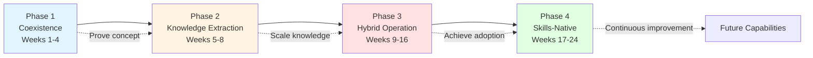
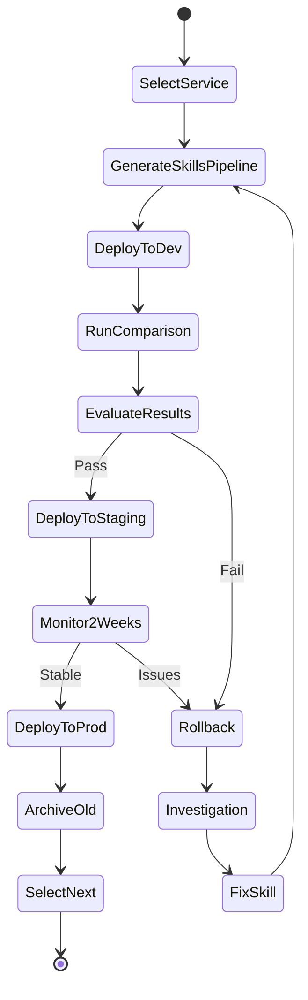
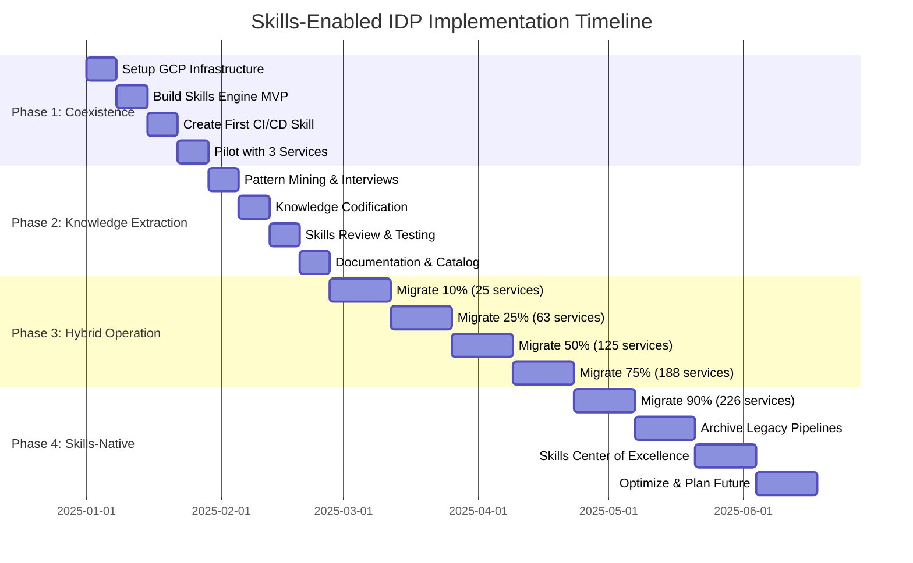
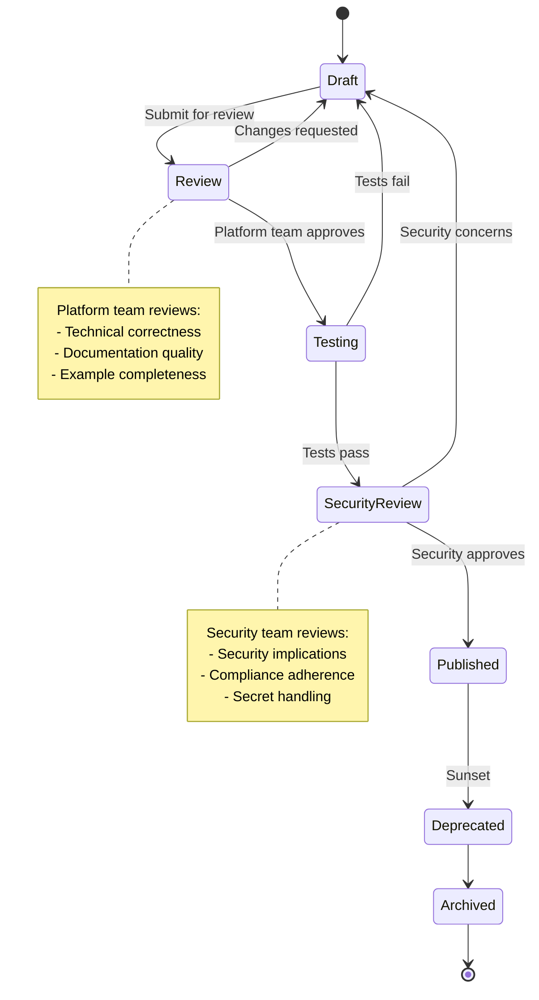

# Implementation Guide: Execution Roadmap

> **4-phase migration strategy, 24-week timeline, success metrics, and operational playbook for rolling out Skills-enabled IDPs**

[← Previous: POC System Design](03-POC-SYSTEM-DESIGN.md) | [Back to Overview](README.md)

---

## Table of Contents

- [Migration Strategy Overview](#migration-strategy-overview)
- [Phase 1: Coexistence (Weeks 1-4)](#phase-1-coexistence-weeks-1-4)
- [Phase 2: Knowledge Extraction (Weeks 5-8)](#phase-2-knowledge-extraction-weeks-5-8)
- [Phase 3: Hybrid Operation (Weeks 9-16)](#phase-3-hybrid-operation-weeks-9-16)
- [Phase 4: Skills-Native Operation (Weeks 17-24)](#phase-4-skills-native-operation-weeks-17-24)
- [24-Week Implementation Timeline](#24-week-implementation-timeline)
- [Success Metrics & KPIs](#success-metrics--kpis)
- [Risk Mitigation & Contingency](#risk-mitigation--contingency)
- [Governance & Best Practices](#governance--best-practices)
- [Team Structure & Responsibilities](#team-structure--responsibilities)

---

## Migration Strategy Overview

The migration to Skills-enabled IDPs follows a four-phase strategy that maintains business continuity while progressively adopting Skills-based generation. This approach recognizes that organizations have hundreds of existing pipelines that cannot be rewritten overnight.

### Core Principles

1. **Non-Disruptive**: New capabilities don't break existing workflows
2. **Incremental Value**: Each phase delivers measurable business value
3. **Team Autonomy**: Development teams opt-in at their own pace
4. **Risk-Managed**: Rollback capabilities at every stage
5. **Data-Driven**: Decisions based on metrics, not assumptions

### Migration Phases Overview



---

## Phase 1: Coexistence (Weeks 1-4)

### Objective
Prove Skills can generate pipelines compatible with existing infrastructure without disrupting current workflows.

### Architecture Pattern: Adapter Pattern

```
Skills Layer (New)
    ↓ generates
Cloud Build YAML
    ↓ calls
Existing Shared Libraries (Old)
    ↓ executes
Current Infrastructure
```

### Phase 1 Breakdown (Weeks 1-4)

| Week | Focus | Key Activities | Team | Deliverables |
|------|-------|----------------|------|--------------|
| 1 | GCP Setup | GCP project, Cloud SQL, Cloud Storage, Memorystore, Cloud Build | 2 platform engineers, 1 DevOps | GCP infrastructure operational |
| 2 | Skills Engine | API Gateway, Skills Loader, Claude API integration, monitoring | 2 backend engineers, 1 AI/ML | Skills Engine MVP functional |
| 3 | First Skill | Create gcp-nodejs-cicd v1.0, templates, security scanning | 2 platform engineers, 1 security | Working gcp-nodejs-cicd Skill |
| 4 | Pilot | Select 3 services, generate pipelines, deploy, test, collect feedback | Full team + 3 pilot teams | 3 services with Skills pipelines |

### Success Criteria

✅ **Technical:**
- 10 new services successfully deployed using Skills-generated pipelines
- Zero incidents attributed to Skills-generated pipelines
- Pipeline generation time <30 seconds
- Generated pipelines pass same checks as manual ones

✅ **Business:**
- Developer feedback score >4/5
- Platform team agrees to proceed
- Executive stakeholders approve Phase 2

### Key Decisions

**Go/No-Go Decision Point:**
- Are Skills-generated pipelines production-ready?
- Is the ROI case proven with pilot data?
- Do teams want to adopt this approach?

If YES → Proceed to Phase 2  
If NO → Iterate on Phase 1 for 2 more weeks

---

## Phase 2: Knowledge Extraction (Weeks 5-8)

### Objective
Extract tribal knowledge from existing pipelines and platform team expertise into Skills.

### Architecture Pattern: Strangler Fig Pattern

```
Pipeline Knowledge Extraction Tool
    ↓ analyzes
500+ Existing Pipelines
    ↓ identifies patterns
Common Steps, Configurations, Customizations
    ↓ interviews
Platform Team + Senior Developers
    ↓ codifies into
Enhanced Skills Repository
```

### Phase 2 Breakdown (Weeks 5-8)

| Week | Focus | Key Activities | Team | Deliverables |
|------|-------|----------------|------|--------------|
| 5 | Pattern Mining | Analyze 500+ pipelines, identify patterns, interview platform team | 1 data analyst, 2 platform engineers | Pattern analysis report, priority list |
| 6 | Codification | Convert patterns to 15-20 Skills, domain Skills, validators | 3 platform engineers, 4 domain experts | 15-20 new Skills created |
| 7 | Review & Testing | Platform/security reviews, synthetic testing, catalog, training | Full team + Security + Domain teams | Skills reviewed, catalog published |
| 8 | Documentation | Migration playbook, discovery tools, communication, tracking | 2 technical writers, 2 platform engineers | Migration playbook, dashboard operational |

### Success Criteria

✅ **Technical:**
- 15-20 new Skills created and validated
- All Skills pass security review
- Skills cover 80%+ of common patterns
- Documentation completeness score >90%

✅ **Business:**
- Platform team confident in Skills quality
- Domain teams engaged and contributing
- Executive stakeholders see value in extracted knowledge

---

## Phase 3: Hybrid Operation (Weeks 9-16)

### Objective
Progressively migrate existing services to Skills-generated pipelines while maintaining the option to rollback.

### Architecture Pattern: Feature Flag + Validation Gate Pattern

```
Service Pipeline Request
    ↓ checks
Feature Flag: use_skills_generation = true/false
    ↓ if true
Skills-Generated Pipeline (New)
    ↓ validated against
Existing Pipeline (Old - comparison)
    ↓ metrics comparison
Performance, Reliability, Security
    ↓ if validation passes
Deploy Skills-Generated Pipeline
    ↓ if validation fails
Rollback to Existing Pipeline + Alert Platform Team
```

### Migration Workflow



### Week-by-Week Breakdown

### Phase 3 Breakdown (Weeks 9-16)

| Weeks | Milestone | Services | Key Activities | Team | Deliverables |
|-------|-----------|----------|----------------|------|--------------|
| 9-10 | 10% | 25 | Select low-risk services, generate pipelines, deploy dev/staging/prod, track metrics | 2 platform, 1 coordinator, service teams | 25 migrated, comparison metrics |
| 11-12 | 25% | 63 total | Higher complexity, parallel migration, training sessions | 3 platform, 1 coordinator, service teams | 63 migrated, patterns documented |
| 13-14 | 50% | 125 total | Self-service process, automated tooling, office hours | 2 platform, 2 support, service teams | 125 migrated, self-service established |
| 15-16 | 75% | 188 total | Holdout teams, edge cases, optimize Skills, exec report | Full platform team, service teams | 188 migrated, edge cases handled |

### Safety Mechanisms

**Escape Hatch:**
```bash
# One-command rollback to previous pipeline
platform-cli rollback --pipeline payment-api --to-version previous
```

**Canary Analysis:**
- Automated metrics comparison (error rate, latency, success rate)
- Alert if Skills-generated pipeline underperforms baseline
- Auto-rollback if critical thresholds breached

**Circuit Breaker:**
- If >10% of migrations fail, pause and investigate
- Platform team conducts root cause analysis
- Resume only after issue resolved

### Success Criteria

✅ **Technical:**
- 75% of services migrated successfully
- <5% rollback rate
- Zero production incidents from migrations
- Performance meets or exceeds baseline

✅ **Business:**
- Developer satisfaction maintains >4.5/5
- Platform team ticket volume reduced 40%+
- Time-to-production reduced 60%+

---

## Phase 4: Skills-Native Operation (Weeks 17-24)

### Objective
Achieve full Skills-based pipeline generation with legacy pipelines archived.

### Architecture: Pure Skills-Based

```
Developer Request
    ↓ natural language
Skills Orchestration Engine
    ↓ analyzes intent
Organizational Context + Historical Patterns
    ↓ generates
Production-Ready Pipeline
    ↓ validates
Policy Engine (deterministic checks)
    ↓ approves
Governance Layer (if required)
    ↓ commits
Git Repository
    ↓ triggers
Cloud Build Execution
```

### Week-by-Week Breakdown

### Phase 4 Breakdown (Weeks 17-24)

| Weeks | Focus | Key Activities | Team | Deliverables |
|-------|-------|----------------|------|--------------|
| 17-18 | 90% Migration | Migrate remaining 38 services, edge cases, custom Skills, celebrate | Full platform, service teams, domain experts | 226 services migrated (90%+) |
| 19-20 | Archival | Archive legacy pipelines, update docs, decommission old infrastructure | 2 platform, 1 documentation | Legacy pipelines archived |
| 21-22 | Center of Excellence | Governance model, contribution process, review board, testing framework | Platform lead, domain leads, security lead | Governance established |
| 23-24 | Optimization | Performance tuning, Skills cleanup, roadmap, exec presentation, lessons learned | Full team | Optimization complete, roadmap defined |

### Maintenance Model

**Platform Team Responsibilities:**
- Own core Skills (CI/CD, security, deployment)
- Maintain Skills Engine infrastructure
- Support domain teams
- Monitor system health
- Quarterly Skills effectiveness reviews

**Domain Team Responsibilities:**
- Own domain-specific Skills (payment, ML, data)
- Contribute improvements
- Review Skills changes affecting their domain
- Provide feedback on Skills effectiveness

**Security Team Responsibilities:**
- Own security and compliance Skills
- Review all Skills for security implications
- Update policies and validators
- Conduct quarterly security audits

### Success Criteria

✅ **Technical:**
- 90%+ of services using Skills-generated pipelines
- Pipeline generation time consistently <30 seconds
- Zero critical incidents attributed to Skills
- System availability >99.5%

✅ **Business:**
- Developer satisfaction >4.5/5
- Platform team ticket volume reduced 50%+
- Time-to-production <1 day for new services
- ROI target achieved (cost savings + velocity gains)

---

## 24-Week Implementation Timeline



### Critical Milestones

| Milestone | Week | Success Criteria | Go/No-Go Decision |
|-----------|------|------------------|-------------------|
| **M1: POC Complete** | 4 | 3 pilot services successful | Proceed to Phase 2? |
| **M2: Skills Catalog** | 8 | 15-20 Skills created & validated | Begin migration? |
| **M3: 25% Migrated** | 12 | 63 services, <5% rollback rate | Scale to 50%? |
| **M4: 75% Migrated** | 16 | 188 services, metrics on target | Push to 90%? |
| **M5: Skills-Native** | 24 | 90%+ migrated, ROI achieved | Declare success |

---

## Success Metrics & KPIs

### Technical Metrics

#### Pipeline Generation Metrics

**Target:** <30 seconds (Baseline: 4-8 hours)

| Metric | Week 4 | Week 8 | Week 12 | Week 16 | Week 24 | Target |
|--------|--------|--------|---------|---------|---------|--------|
| p50 generation time | 25s | 22s | 20s | 18s | 15s | <30s |
| p95 generation time | 45s | 40s | 35s | 30s | 28s | <60s |
| Success rate | 95% | 97% | 98% | 99% | 99.5% | >95% |

#### Build Execution Metrics

**Target:** Node.js <5 min, Angular <8 min (Baseline: 8-15 min)

| Metric | Week 4 | Week 12 | Week 24 | Target |
|--------|--------|---------|---------|--------|
| Node.js build (p95) | 4.5min | 4.2min | 3.8min | <5min |
| Angular build (p95) | 7.5min | 7.0min | 6.5min | <8min |
| Docker build (p95) | 2.8min | 2.5min | 2.2min | <3min |

#### Security Compliance

**Target:** 100% (Baseline: 65%)

| Metric | Week 4 | Week 12 | Week 24 | Target |
|--------|--------|---------|---------|--------|
| Pipelines with all scans | 100% | 100% | 100% | 100% |
| Critical vulnerabilities | 0 | 0 | 0 | 0 |
| Compliance violations | 0 | 0 | 0 | 0 |

### Business Metrics

#### Developer Satisfaction

**Target:** >4.5/5 (Baseline: 2.8/5)

| Survey Question | Week 4 | Week 12 | Week 24 | Target |
|----------------|--------|---------|---------|--------|
| Overall satisfaction | 4.2 | 4.5 | 4.7 | >4.5 |
| Ease of use | 4.5 | 4.6 | 4.8 | >4.5 |
| Time savings | 4.3 | 4.6 | 4.7 | >4.5 |
| Would recommend | 85% | 92% | 95% | >90% |

#### Platform Team Efficiency

**Target:** >50% ticket reduction (Baseline: 120 tickets/month)

| Metric | Month 1 | Month 3 | Month 6 | Target |
|--------|---------|---------|---------|--------|
| Support tickets | 95 | 65 | 45 | <60 |
| Avg resolution time | 2.5h | 1.8h | 1.2h | <2h |
| Self-service rate | 65% | 80% | 90% | >80% |

#### Time-to-Production

**Target:** <1 day (Baseline: 4-7 days)

| Metric | Week 4 | Week 12 | Week 24 | Target |
|--------|--------|---------|---------|--------|
| New service (median) | 2.5 days | 1.5 days | 0.8 days | <1 day |
| Pipeline changes (median) | 3 hours | 2 hours | 1 hour | <3 hours |
| Hotfix deployment | 45 min | 30 min | 20 min | <30 min |

### ROI Calculation

**Cost Savings:**
```
Platform Team Time Savings:
├── Support ticket reduction: 75 tickets/month × 2 hours × $100/hour = $15,000/month
├── Pipeline maintenance: 40 hours/month × $100/hour = $4,000/month
└── Total monthly savings: $19,000

Developer Productivity Gains:
├── 250 developers × 4 hours/month saved × $100/hour = $100,000/month
├── Faster onboarding: 10 new devs/month × 20 hours × $100/hour = $20,000/month
└── Total monthly gains: $120,000/month

Annual ROI:
├── Benefits: ($19k + $120k) × 12 = $1,668,000/year
├── Costs: $500,000 (implementation) + $200,000/year (operation)
└── Net ROI Year 1: $968,000 (138% return)
```

---

## Risk Mitigation & Contingency

### Technical Risks

#### Risk 1: AI Service Outage

**Impact:** High  
**Likelihood:** Low  
**Detection:** API health checks, error rate monitoring

**Mitigation:**
- Fallback to template-based generation
- Cache recently generated pipelines
- Implement retry logic with exponential backoff
- Multi-region AI service deployment

**Contingency Plan:**
```
IF Claude API unavailable:
  1. Switch to fallback mode (template generation)
  2. Alert platform team
  3. Continue operations with reduced functionality
  4. Resume Skills mode when service restored
```

#### Risk 2: Skill Bugs in Production

**Impact:** High  
**Likelihood:** Medium  
**Detection:** Pipeline failure rates, automated testing

**Mitigation:**
- Comprehensive Skill testing before release
- Gradual rollout with canary analysis
- Instant rollback capability
- Version pinning for stability

**Contingency Plan:**
```
IF Skill causing production issues:
  1. Immediate rollback to previous Skill version
  2. Root cause analysis
  3. Fix and test in isolation
  4. Gradual re-release with enhanced monitoring
```

#### Risk 3: Performance Degradation

**Impact:** Medium  
**Likelihood:** Medium  
**Detection:** Response time monitoring, SLO alerts

**Mitigation:**
- Aggressive caching strategy
- Horizontal scaling of Skills Engine
- Performance testing in CI/CD
- Circuit breakers for slow dependencies

**Contingency Plan:**
```
IF performance degrades:
  1. Scale out Skills Engine instances
  2. Increase cache hit ratio
  3. Throttle non-critical requests
  4. Optimize slow Skills
```

### Organizational Risks

#### Risk 4: Resistance to Adoption

**Impact:** High  
**Likelihood:** Medium  
**Detection:** Adoption metrics, team feedback, survey results

**Mitigation:**
- Early involvement of influential developers
- Success stories and champions program
- Comprehensive training and documentation
- Gradual rollout with opt-in

**Contingency Plan:**
```
IF adoption stalls:
  1. Conduct listening sessions with resistant teams
  2. Identify and address specific concerns
  3. Provide additional training and support
  4. Adjust rollout timeline if needed
```

#### Risk 5: Platform Team Burnout

**Impact:** Critical  
**Likelihood:** Medium  
**Detection:** Team surveys, velocity metrics, ticket backlog

**Mitigation:**
- Clear scope and realistic timelines
- Support from external consultants if needed
- Celebrate milestones and wins
- Protect team from scope creep

**Contingency Plan:**
```
IF team shows burnout signs:
  1. Extend timeline by 4-8 weeks
  2. Reduce scope of Phase 3/4
  3. Bring in additional resources
  4. Mandatory time off for team members
```

---

## Governance & Best Practices

### Skills Ownership Model

**Centralized Skills (Platform Team):**
- Infrastructure patterns (Cloud Build, GKE, Terraform)
- CI/CD standards and templates
- Security and compliance requirements
- Testing frameworks and patterns
- Documentation templates

**Decentralized Skills (Domain Teams):**
- Domain-specific business logic patterns (payment processing, ML workflows)
- Service-specific architectural patterns
- Team-specific tools and workflows
- Specialized technical domains

### Quality Standards for Skills

Effective Skills must be:

1. **Specific:** Contains concrete, actionable guidance with examples
2. **Versioned:** Clear semantic versioning with change management
3. **Tested:** Validated outputs that meet organizational standards
4. **Maintained:** Regular updates as patterns evolve (quarterly review)
5. **Discoverable:** Clear descriptions that help Claude understand when to use them

### Skills Review Process



### Security and Compliance

**Access Control:**
- Skills can contain sensitive organizational information
- Implement RBAC based on role and clearance level
- Audit all Skill access and modifications

**Audit Logging:**
- Track which Skills are used for what purposes
- Enable compliance auditing
- Usage optimization

**Secret Management:**
- Never embed credentials in Skills
- Use references to GCP Secret Manager
- Rotate secrets automatically

**Approval Workflows:**
- High-risk Skills (infrastructure, production deployments) require approval
- Multi-level approval for critical changes
- Emergency bypass process with post-facto review

---

## Team Structure & Responsibilities

### Implementation Team

**Platform Engineering Lead** (1)
- Overall program accountability
- Stakeholder management
- Resource allocation
- Risk management

**Senior Platform Engineers** (2-3)
- Skills Engine development
- Integration with GCP services
- Performance optimization
- Technical leadership

**Backend/Fullstack Engineers** (2)
- API development
- Web portal development
- CLI tool development
- Integration testing

**AI/ML Engineer** (1)
- Claude API integration
- Prompt engineering
- Skills optimization
- AI performance tuning

**Security Engineer** (1)
- Security Skills development
- Policy-as-code implementation
- Compliance validation
- Security reviews

**DevOps Engineers** (2)
- GCP infrastructure
- CI/CD pipeline setup
- Monitoring and alerting
- Operational support

**Technical Writer** (1)
- Skills documentation
- Migration playbooks
- Training materials
- User guides

**Program Manager** (1)
- Timeline management
- Milestone tracking
- Cross-team coordination
- Status reporting

### Ongoing Operations Team (Post-Implementation)

**Platform Team (3 engineers)**
- Maintain Skills Engine
- Support domain teams
- Monitor system health
- Quarterly Skills reviews

**Skills Contributors (Distributed)**
- Domain teams contribute domain Skills
- Security team maintains security Skills
- Platform team maintains core Skills

---

## Looking Forward: Beyond Week 24

### Expansion Roadmap

**Months 7-9: Infrastructure as Code**
- Skills for Terraform/Pulumi generation
- Cloud resource provisioning
- Network configuration
- Security group management

**Months 10-12: Testing & Quality**
- Skills for test generation
- Quality gate configuration
- Performance testing
- Integration test patterns

**Months 13-15: Observability**
- Monitoring dashboard generation
- Alert configuration
- Log analysis patterns
- SLI/SLO definition

**Months 16-18: Additional Languages**
- Java/Spring Boot Skills
- Python/FastAPI Skills
- Go service Skills
- .NET/C# Skills

### Continuous Improvement

**Skills Effectiveness Reviews (Quarterly)**
- Usage analytics review
- Developer feedback analysis
- Performance optimization
- Deprecation decisions

**Platform Health Reviews (Monthly)**
- System reliability metrics
- Security compliance status
- Cost optimization
- Capacity planning

**Developer Experience Surveys (Quarterly)**
- Satisfaction measurement
- Pain point identification
- Feature requests
- Training needs

---

## Conclusion

This 24-week implementation guide provides a structured, risk-managed approach to transforming your IDP with Skills-based capabilities. The phased strategy ensures:

✅ **Business continuity** - Existing services continue working  
✅ **Incremental value** - Benefits delivered every phase  
✅ **Risk mitigation** - Rollback capabilities throughout  
✅ **Team autonomy** - Opt-in adoption, not forced migration  
✅ **Measurable outcomes** - Clear metrics and success criteria

**The transformation is significant, but achievable. Organizations that execute this roadmap will gain:**
- 80%+ reduction in pipeline creation time
- 70%+ faster infrastructure provisioning
- 90%+ fewer standards violations
- 60%+ faster developer onboarding
- 50%+ reduction in platform team tickets

**The competitive advantage is real and measurable. The question is no longer "should we do this?" but "how quickly can we execute?"**

---

**Start your journey:** Review with leadership → Form team → Begin Phase 1

[← Previous: POC System Design](03-POC-SYSTEM-DESIGN.md) | [Back to Overview](README.md)
