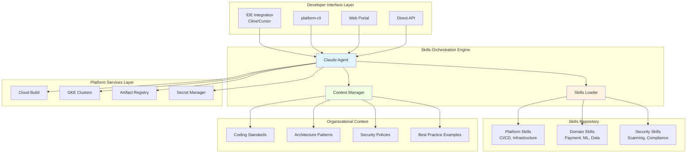

# High-Level System Architecture

> **Complete system architecture showing all layers from developer interfaces to cloud platform services**

[← Back to Architecture](../02-ARCHITECTURE.md) | [All Diagrams](README.md)

---

## System Architecture Overview

This diagram shows the complete Skills-enabled IDP architecture, including developer interfaces, Skills orchestration, organizational context, and integration with platform services.

## Key Components

### Developer Interface Layer
- **IDE Integration**: Primary workflow via Cline/Cursor extensions
- **CLI**: Terminal-based automation with platform-cli
- **Portal**: Web-based discovery and exploration
- **API**: Programmatic integration for custom tools

### Skills Orchestration Engine
- **Claude Agent**: Natural language understanding and workflow orchestration
- **Skills Loader**: Progressive disclosure and on-demand loading
- **Context Manager**: Organizational knowledge and pattern management

### Skills Repository
- **Platform Skills**: Core CI/CD and infrastructure patterns
- **Domain Skills**: Business-domain-specific expertise
- **Security Skills**: Compliance and security validation

### Organizational Context
- **Coding Standards**: Style guides and conventions
- **Architecture Patterns**: Proven design patterns
- **Security Policies**: Compliance requirements
- **Best Practice Examples**: Reference implementations

### Platform Services Layer
- **Cloud Build**: CI/CD execution
- **GKE**: Container orchestration
- **Artifact Registry**: Container image storage
- **Secret Manager**: Credentials management

---

[← Back to Architecture](../02-ARCHITECTURE.md) | [All Diagrams](README.md)
