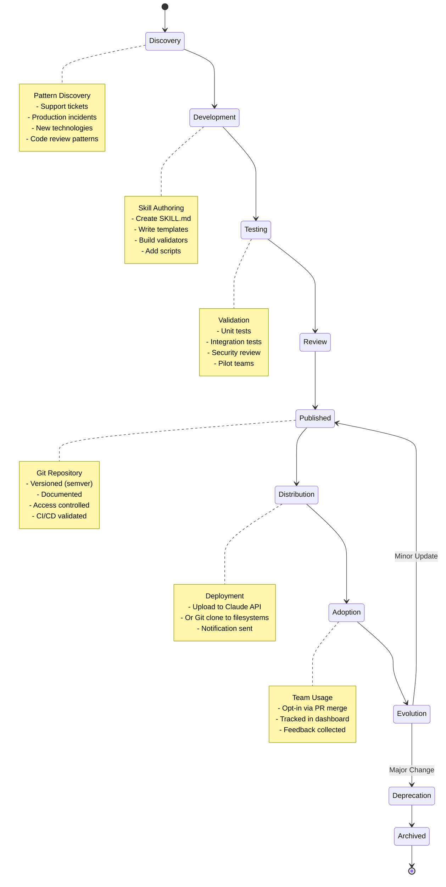

# Skills Lifecycle

> **Complete lifecycle of a Skill from discovery through deprecation**

[← Back to Diagrams Index](README.md) | [← Architecture](../02-ARCHITECTURE.md)

---

## Skills Lifecycle State Machine

## Lifecycle Phases

### 1. Discovery
**Trigger:** Platform team identifies pattern from tickets, incidents, or research
**Output:** Decision to create new Skill
**Duration:** 1-2 weeks

### 2. Development
**Activities:** Author SKILL.md, create templates, write validators
**Owner:** Platform engineers + domain experts
**Duration:** 2-3 weeks

### 3. Testing
**Activities:** Unit tests, integration tests, security review, pilot
**Quality Gates:** All tests pass, security approved
**Duration:** 1-2 weeks

### 4. Review
**Activities:** Peer review, platform lead approval
**Approvers:** Platform team, security team (if applicable)
**Duration:** 3-5 days

### 5. Published
**Activities:** Merge to main branch, tag version, publish docs
**Artifact:** Skill v1.0.0 in Git repository
**Duration:** <1 day

### 6. Distribution
**Activities:** Upload to Claude API or notify developers to pull
**Reach:** All workspace members or developers with access
**Duration:** Instant (API) or up to 1 week (filesystem)

### 7. Adoption
**Measure:** % of relevant services using the Skill
**Tracking:** Dashboard shows adoption rate
**Duration:** Ongoing (2-8 weeks for 90% adoption)

### 8. Evolution
**Trigger:** Feedback, new requirements, improvements
**Output:** Updated Skill version
**Frequency:** Monthly to quarterly

### 9. Deprecation
**Trigger:** Major breaking change or obsolescence
**Timeline:** 6-month notice minimum
**Output:** Archived Skill (read-only for history)

---

[← Back to Diagrams Index](README.md) | [← Architecture](../02-ARCHITECTURE.md)
