# Data Flow with Error Handling

> **Complete request/response flow for pipeline generation including all error states, validation gates, and recovery paths**

[← Back to Diagrams Index](README.md) | [← Architecture](../02-ARCHITECTURE.md)

---

## Complete Pipeline Generation Flow

This diagram shows the **production-ready data flow** including authentication, caching, validation, error handling, and recovery mechanisms.

```mermaid
sequenceDiagram
    participant Dev as Developer
    participant IDE as Cline IDE
    participant Gateway as Cloud API Gateway
    participant Auth as Identity Platform
    participant Engine as Skills Engine<br/>(Cloud Run)
    participant Redis as Memorystore Redis
    participant DB as Cloud SQL<br/>PostgreSQL
    participant Claude as Claude API
    participant Validator as OPA Policy<br/>Validator
    participant GCS as Cloud Storage<br/>(Skills Repo)
    participant GitHub as GitHub API
    participant Monitor as Cloud Monitoring
    
    Dev->>IDE: "Create CI/CD pipeline for payment-api"
    IDE->>Gateway: POST /api/v1/pipelines/generate<br/>+ API Key
    
    alt Authentication Failure
        Gateway->>Auth: Validate API Key
        Auth-->>Gateway: Invalid/Expired
        Gateway-->>IDE: 401 Unauthorized<br/>{"error": "Invalid API key"}
        IDE-->>Dev: ❌ Show error + refresh instructions
    end
    
    Gateway->>Auth: Validate API Key
    Auth-->>Gateway: ✓ Valid (user_id, org_id, scopes)
    
    alt Rate Limit Exceeded
        Gateway->>Gateway: Check rate limit<br/>(100 req/min per user)
        Gateway-->>IDE: 429 Too Many Requests<br/>Retry-After: 60
        IDE-->>Dev: ⏳ Rate limited, retry in 60s
    end
    
    Gateway->>Engine: Forward request + context<br/>(user_id, org_id, intent, service_context)
    Monitor->>Monitor: Log request (trace_id)
    
    Engine->>Redis: GET skills_metadata:<org_id>
    
    alt Cache Hit
        Redis-->>Engine: Cached Skills metadata (5min TTL)
    else Cache Miss
        Engine->>GCS: List Skills in gs://org-skills/
        GCS-->>Engine: Skills metadata array
        Engine->>Redis: SET skills_metadata:<org_id> (TTL=300s)
    end
    
    Engine->>Engine: Analyze intent + context<br/>Select relevant Skills
    
    Engine->>GCS: GET full Skill content<br/>gcp-nodejs-cicd/SKILL.md
    
    alt Skill Not Found
        GCS-->>Engine: 404 Not Found
        Engine->>Monitor: Log error (skill_missing)
        Engine-->>Gateway: 404 Not Found<br/>{"error": "Skill not found"}
        Gateway-->>IDE: 404 response
        IDE-->>Dev: ❌ Skill missing, contact platform team
    end
    
    GCS-->>Engine: Skill content (instructions, templates)
    
    Engine->>Claude: POST /v1/messages<br/>+ Skills context + intent<br/>Timeout: 30s
    
    alt Claude API Timeout/Failure
        Claude-->>Engine: Timeout (>30s) or 5xx error
        Engine->>Engine: Retry #1 (exponential backoff 2s)
        Engine->>Claude: Retry request
        Claude-->>Engine: Failure again
        Engine->>Engine: Retry #2 (backoff 4s)
        Engine->>Claude: Retry request
        Claude-->>Engine: Failure (3 retries exhausted)
        
        alt Circuit Breaker Open
            Engine->>Monitor: Circuit breaker opened<br/>(5 consecutive failures)
            Engine->>Engine: Fallback to template generation
            Engine->>GCS: GET template (fallback mode)
            GCS-->>Engine: Base template
            Engine->>Engine: Generate using templates only
            Note over Engine: Degraded mode: no AI customization
        else Circuit Breaker Closed
            Engine-->>Gateway: 503 Service Unavailable<br/>{"error": "AI service unavailable"}
            Gateway-->>IDE: 503 response
            IDE-->>Dev: ⚠️ AI unavailable, retry or use templates
        end
    end
    
    Claude-->>Engine: Generated artifacts<br/>(cloudbuild.yaml, k8s manifests, docs)
    Monitor->>Monitor: Log AI generation time (8.3s)
    
    Engine->>Validator: Validate artifacts against policies<br/>(OPA policies)
    
    Validator->>Validator: Check security policies<br/>- Secrets in vault ✓<br/>- No hardcoded credentials ✓<br/>- Required scans present ✓
    
    Validator->>Validator: Check compliance policies<br/>- SOC2 requirements ✓<br/>- Audit logging enabled ✓<br/>- Approval gates for prod ✓
    
    alt Policy Validation Failure
        Validator-->>Engine: Validation failed<br/>[{"policy": "security.secrets",<br/>"violation": "hardcoded API key"}]
        Engine->>Monitor: Log validation failure
        Engine-->>Gateway: 422 Unprocessable Entity<br/>{"error": "Policy violations", "details": [...]}
        Gateway-->>IDE: 422 response
        IDE-->>Dev: ❌ Policy violations found<br/>Show violations + remediation steps
    end
    
    Validator-->>Engine: ✓ All policies passed
    
    Engine->>DB: BEGIN TRANSACTION
    Engine->>DB: INSERT INTO pipelines<br/>(pipeline_id, org_id, config, skills_used)
    
    alt Database Error
        DB-->>Engine: Error (connection timeout, constraint violation)
        Engine->>DB: ROLLBACK TRANSACTION
        Engine->>Monitor: Log database error
        Engine-->>Gateway: 500 Internal Server Error<br/>{"error": "Database error", "trace_id": "..."}
        Gateway-->>IDE: 500 response
        IDE-->>Dev: ❌ System error, contact platform team<br/>Reference: trace_id
    end
    
    DB-->>Engine: ✓ Insert successful
    Engine->>DB: COMMIT TRANSACTION
    
    Engine->>GitHub: Create/Update files<br/>POST /repos/{org}/{repo}/contents
    
    alt GitHub API Failure
        GitHub-->>Engine: 403 Forbidden (permissions)<br/>or 409 Conflict (branch protection)
        Engine->>Monitor: Log GitHub error
        Engine->>DB: UPDATE pipelines SET status='github_failed'
        Engine-->>Gateway: 500 Internal Server Error<br/>{"error": "Failed to commit to GitHub"}
        Gateway-->>IDE: 500 response
        IDE-->>Dev: ⚠️ Pipeline generated but not committed<br/>Manual push required
    end
    
    GitHub-->>Engine: ✓ Files committed (commit_sha)
    
    Engine->>DB: UPDATE pipelines<br/>SET status='active', commit_sha='...'
    
    Engine->>GCS: Store artifacts for audit<br/>gs://pipelines/{pipeline_id}/
    GCS-->>Engine: ✓ Stored
    
    Engine->>Monitor: Log success metrics<br/>(generation_time_ms, skills_used)
    
    Engine-->>Gateway: 201 Created<br/>{"pipeline_id": "...",<br/>"artifacts": {...},<br/>"skills_used": [...]}
    
    Gateway-->>IDE: 201 response
    IDE-->>Dev: ✅ Pipeline created successfully<br/>Show artifacts + next steps
```



## Documented Assumptions

### Performance Targets (SLAs)

```yaml
API Gateway:
  - Authentication: <50ms p99
  - Rate limiting: <10ms p99
  - Total overhead: <100ms p99

Skills Engine:
  - Skills metadata load: <200ms p95 (cached), <1s p95 (uncached)
  - Intent analysis: <500ms p95
  - Total generation: <30s p95

Claude API:
  - Request timeout: 30s
  - Expected response: <10s p95
  - Retry backoff: 2s, 4s, 8s (exponential)

Policy Validation:
  - OPA evaluation: <200ms p99
  - Security checks: <500ms p99

Database:
  - Query latency: <50ms p99
  - Transaction time: <200ms p99
  - Connection pool: 10-50 connections

GitHub API:
  - Commit operation: <2s p95
  - Retry on failure: 3 attempts

Total End-to-End:
  - Happy path: <15s p95
  - With retries: <45s p99
  - SLA target: <60s
```

### Error Response Codes

```yaml
401 Unauthorized:
  - Invalid/expired API key
  - Missing authentication
  - Action: Refresh credentials

403 Forbidden:
  - Insufficient permissions
  - Org access denied
  - Action: Request access from admin

404 Not Found:
  - Skill not found
  - Repository not found
  - Action: Contact platform team

422 Unprocessable Entity:
  - Policy validation failure
  - Invalid configuration
  - Action: Fix violations and retry

429 Too Many Requests:
  - Rate limit exceeded
  - Action: Wait and retry (Retry-After header)

500 Internal Server Error:
  - Database error
  - Unexpected failure
  - Action: Contact platform team with trace_id

503 Service Unavailable:
  - Claude API down
  - Circuit breaker open
  - Action: Retry later or use fallback
```

### Circuit Breaker Configuration

```yaml
Circuit Breaker (Claude API):
  Closed → Open:
    - Trigger: 5 consecutive failures
    - Window: 60 seconds
    
  Open → Half-Open:
    - Wait time: 30 seconds
    - Test request: Single request to verify recovery
    
  Half-Open → Closed:
    - Success: 2 consecutive successful requests
    
  Half-Open → Open:
    - Failure: Any failure during half-open
    
  Fallback Behavior:
    - Use template generation (no AI customization)
    - Log degraded mode in monitoring
    - Alert platform team
```

### Caching Strategy

```yaml
Redis Caching:
  Skills Metadata:
    - Key: skills_metadata:{org_id}
    - TTL: 300 seconds (5 minutes)
    - Invalidation: On Skill publish
    
  User Context:
    - Key: user_context:{user_id}
    - TTL: 600 seconds (10 minutes)
    - Includes: org_id, teams, permissions
    
  Rate Limit Counters:
    - Key: rate_limit:{user_id}:{minute}
    - TTL: 120 seconds
    - Limit: 100 requests/minute per user
```

### Database Transaction Strategy

```yaml
Transaction Isolation: READ COMMITTED

Pipeline Creation:
  1. BEGIN TRANSACTION
  2. INSERT INTO pipelines (with optimistic locking)
  3. INSERT INTO audit_logs
  4. UPDATE usage_metrics
  5. COMMIT or ROLLBACK
  
Connection Pool:
  - Min connections: 10
  - Max connections: 50
  - Idle timeout: 300s
  - Max lifetime: 1800s
  
Retry Strategy:
  - Deadlock: Retry 3 times with jitter
  - Connection timeout: Retry 2 times
  - Other errors: No retry, return 500
```

### GCP Native Stack

```yaml
Compute:
  - Skills Engine: Cloud Run (auto-scaling 0-100 instances)
  - Min instances: 2 (to avoid cold starts)
  - Max instances: 100
  - Concurrency: 80 requests per instance
  - CPU: 2 vCPU, Memory: 4GB

Storage:
  - Cloud SQL PostgreSQL: db-custom-4-16384 (HA)
  - Memorystore Redis: Basic tier, 5GB
  - Cloud Storage: Standard class, multi-region

Networking:
  - Cloud Load Balancing (HTTPS)
  - Cloud Armor (DDoS protection)
  - VPC Service Controls (perimeter)

Security:
  - Identity Platform (OAuth 2.0 + Google Workspace)
  - Binary Authorization (container signing)
  - Secret Manager (all credentials)

Observability:
  - Cloud Monitoring (metrics, alerts)
  - Cloud Logging (structured JSON logs)
  - Cloud Trace (distributed tracing)
  - Error Reporting (exception aggregation)
```

## Key Decision Points in Flow

### 1. Cache vs Database
- **Skills metadata**: Cache in Redis (5min TTL) for performance
- **User context**: Cache in Redis (10min TTL) to reduce DB load
- **Rate limits**: Redis only (ephemeral, high-throughput)

### 2. Synchronous vs Asynchronous
- **Generation**: Synchronous (developer waiting)
- **GitHub commit**: Synchronous (need immediate feedback)
- **Audit logging**: Asynchronous (Pub/Sub topic)
- **Metrics**: Asynchronous (batch write every 10s)

### 3. Retry Strategy
- **Claude API**: 3 retries with exponential backoff (2s, 4s, 8s)
- **GitHub API**: 3 retries with linear backoff (1s, 2s, 3s)
- **Database**: Conditional (deadlocks only)

### 4. Fallback Behavior
- **Claude unavailable**: Template generation (degraded mode)
- **GitHub unavailable**: Store artifacts in GCS, alert user
- **Database unavailable**: Return 500, don't attempt generation

## Monitoring & Alerting

### Critical Metrics

```yaml
Red Metrics (Error Budget):
  - Request rate: requests/second
  - Error rate: errors/second (target: <1%)
  - Latency: p50, p95, p99 (target: p95 <30s)

Golden Signals:
  - Latency: Distribution of generation times
  - Traffic: Requests per minute
  - Errors: 4xx/5xx rates by endpoint
  - Saturation: CPU/memory utilization

Custom Metrics:
  - skills_load_time_ms (histogram)
  - claude_api_latency_ms (histogram)
  - policy_validation_failures (counter)
  - circuit_breaker_state (gauge: 0=closed, 1=open, 2=half-open)
  - cache_hit_rate (gauge: 0-1)
```

### Alerting Rules

```yaml
P0 (Page immediately):
  - Error rate >5% for 5 minutes
  - p99 latency >60s for 5 minutes
  - Circuit breaker open for >5 minutes
  - Database connection pool exhausted

P1 (Alert during business hours):
  - Error rate >2% for 15 minutes
  - p95 latency >40s for 15 minutes
  - Cache hit rate <50% for 30 minutes

P2 (Email notification):
  - Policy validation failures >10% for 1 hour
  - GitHub API errors >5% for 1 hour
```

---

## Why This Diagram Matters

This production-quality data flow shows:

✅ **Complete error handling** - Every failure path has recovery or degradation
✅ **Real performance targets** - SLAs based on actual system constraints
✅ **Documented assumptions** - Tech stack, timeouts, retry logic all specified
✅ **Operational reality** - Circuit breakers, caching, monitoring included

**An implementation team could build from this diagram.**

---

[← Back to Diagrams Index](README.md) | [← Architecture](../02-ARCHITECTURE.md)
