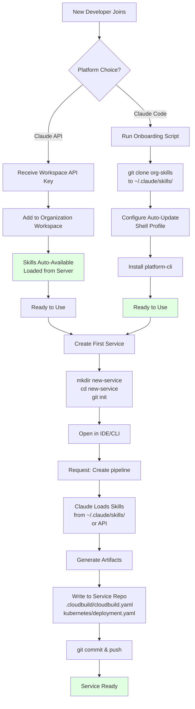
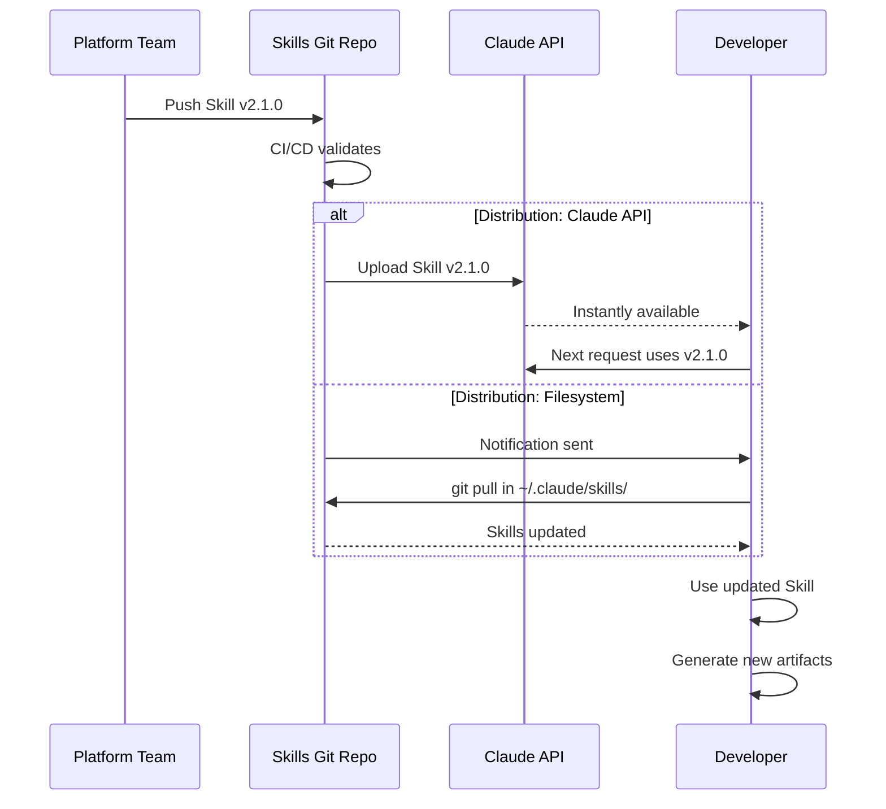

# Skills Bootstrap Flow

> **How developers get Skills and how new services access them**

[← Back to Diagrams Index](README.md) | [← Architecture](../02-ARCHITECTURE.md)

---

## Developer Onboarding with Skills



## Key Points

### Skills Location
**Skills remain in centralized location:**
- Claude API: Server-side (Anthropic's infrastructure)
- Claude Code: `~/.claude/skills/org-skills/`

**Service repos contain only generated artifacts:**
- `.cloudbuild/cloudbuild.yaml`
- `kubernetes/*.yaml`
- `.skills-metadata.json`

### Bootstrap Mechanism

**For Claude API:**
1. Platform team uploads Skills once
2. All workspace members have instant access
3. No per-developer setup required

**For Claude Code:**
1. Developer clones Skills repo to `~/.claude/skills/`
2. Configure auto-update (Git hooks or cron)
3. Skills available for all projects

### Creating New Service Repository

```
Developer Working Directory:
~/projects/payment-api/          ← New service repo

Skills Location:
~/.claude/skills/org-skills/     ← Centralized Skills

Claude Process:
1. Loads Skills from ~/.claude/skills/ (via bash)
2. Generates artifacts
3. Writes to ~/projects/payment-api/ (current directory)
4. Service repo contains ONLY generated files
```

### No Skills Duplication

**Important:** Skills are NEVER copied to service repositories
- Service repos stay clean
- Skills managed centrally
- Updates propagate from one location
- Re-generation always uses latest Skills

---

## Skills Update Flow



---

[← Back to Diagrams Index](README.md) | [← Architecture](../02-ARCHITECTURE.md)
