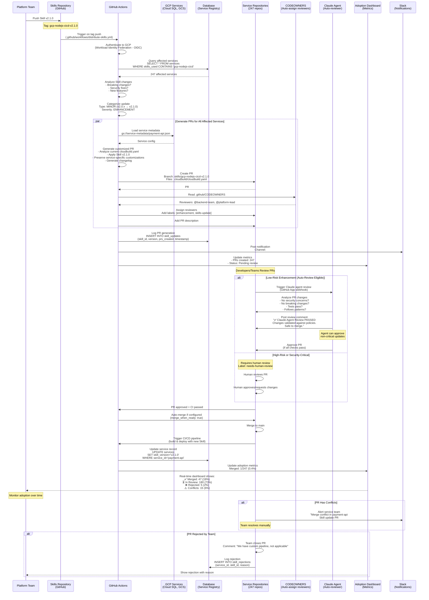

# GitOps Distribution Flow

> **How Skills updates propagate to service repositories through automated PR generation with human/agentic review**

[← Back to Diagrams Index](README.md) | [← Architecture](../02-ARCHITECTURE.md)

---

## Skills Update Workflow

This diagram shows the **production-ready GitOps workflow** for distributing Skills updates across hundreds of service repositories using GitHub Actions with OIDC authentication to GCP.



## Documented Assumptions

### GitHub Actions Workflow

```yaml
# .github/workflows/distribute-skills.yml
name: Distribute Skills Update

on:
  push:
    tags:
      - '*-v*.*.*'  # Matches: gcp-nodejs-cicd-v2.1.0

permissions:
  id-token: write  # Required for OIDC
  contents: read

jobs:
  distribute:
    runs-on: ubuntu-latest
    
    steps:
      - name: Checkout Skills repo
        uses: actions/checkout@v4
      
      - name: Authenticate to GCP
        uses: google-github-actions/auth@v2
        with:
          workload_identity_provider: 'projects/123/locations/global/workloadIdentityPools/github/providers/github-oidc'
          service_account: 'skills-distributor@project.iam.gserviceaccount.com'
      
      - name: Parse Skill metadata
        id: metadata
        run: |
          SKILL_NAME=$(echo ${{ github.ref_name }} | sed 's/-v.*//')
          VERSION=$(echo ${{ github.ref_name }} | sed 's/.*-v//')
          echo "skill_name=$SKILL_NAME" >> $GITHUB_OUTPUT
          echo "version=$VERSION" >> $GITHUB_OUTPUT
      
      - name: Analyze changes
        id: analyze
        run: |
          # Compare with previous version
          git fetch --tags
          PREV_TAG=$(git describe --tags --abbrev=0 HEAD^)
          
          # Check for breaking changes
          if git diff $PREV_TAG HEAD -- $SKILL_NAME/SKILL.md | grep -q "BREAKING:"; then
            echo "severity=breaking" >> $GITHUB_OUTPUT
            echo "auto_review_eligible=false" >> $GITHUB_OUTPUT
          elif git diff $PREV_TAG HEAD -- $SKILL_NAME/SKILL.md | grep -q "security:"; then
            echo "severity=security" >> $GITHUB_OUTPUT
            echo "auto_review_eligible=false" >> $GITHUB_OUTPUT
          else
            echo "severity=enhancement" >> $GITHUB_OUTPUT
            echo "auto_review_eligible=true" >> $GITHUB_OUTPUT
          fi
      
      - name: Query affected services
        id: services
        run: |
          # Query Cloud SQL via Cloud SQL Proxy
          ./query-affected-services.sh "${{ steps.metadata.outputs.skill_name }}"
          # Outputs: services.json (array of service metadata)
      
      - name: Generate PRs
        env:
          GH_TOKEN: ${{ secrets.GITHUB_TOKEN }}
          SKILL_NAME: ${{ steps.metadata.outputs.skill_name }}
          VERSION: ${{ steps.metadata.outputs.version }}
          SEVERITY: ${{ steps.analyze.outputs.severity }}
        run: |
          # For each affected service
          for service in $(cat services.json | jq -r '.[] | @base64'); do
            SERVICE_DATA=$(echo $service | base64 -d)
            REPO=$(echo $SERVICE_DATA | jq -r '.repository')
            
            # Generate PR
            ./generate-pr.sh "$REPO" "$SKILL_NAME" "$VERSION" "$SEVERITY"
          done
      
      - name: Update dashboard
        run: |
          ./update-adoption-dashboard.sh "${{ steps.metadata.outputs.skill_name }}" "$VERSION"
      
      - name: Notify Slack
        uses: slackapi/slack-github-action@v1
        with:
          webhook: ${{ secrets.SLACK_WEBHOOK }}
          payload: |
            {
              "text": "Skills update distributed",
              "blocks": [
                {
                  "type": "section",
                  "text": {
                    "type": "mrkdwn",
                    "text": "*Skills Update:* `${{ steps.metadata.outputs.skill_name }}` v${{ steps.metadata.outputs.version }}\n*PRs Created:* $(cat services.json | jq length)\n*Severity:* ${{ steps.analyze.outputs.severity }}"
                  }
                }
              ]
            }
```

### PR Generation Logic

```typescript
// generate-pr.ts
interface PRGenerationConfig {
  repository: string;
  skillName: string;
  newVersion: string;
  severity: 'breaking' | 'security' | 'enhancement';
  serviceMetadata: ServiceMetadata;
}

async function generatePR(config: PRGenerationConfig): Promise<void> {
  const { repository, skillName, newVersion, severity, serviceMetadata } = config;
  
  // 1. Clone service repository
  await cloneRepository(repository);
  
  // 2. Create feature branch
  const branchName = `skills/${skillName}-${newVersion}`;
  await createBranch(branchName);
  
  // 3. Load current configuration
  const currentConfig = await loadCloudBuildConfig('.cloudbuild/cloudbuild.yaml');
  
  // 4. Load new Skill
  const newSkill = await loadSkill(skillName, newVersion);
  
  // 5. Apply Skill (preserving customizations)
  const updatedConfig = await applySkill(currentConfig, newSkill, {
    preserveCustomSteps: true,
    preserveEnvironmentVariables: true,
    mergeStrategy: 'smart'  // Don't overwrite service-specific customizations
  });
  
  // 6. Validate generated configuration
  const validation = await validateConfig(updatedConfig);
  if (!validation.valid) {
    console.error(`Validation failed for ${repository}:`, validation.errors);
    await reportValidationFailure(repository, validation.errors);
    return;
  }
  
  // 7. Write updated files
  await writeFile('.cloudbuild/cloudbuild.yaml', updatedConfig);
  await writeFile('.skills-metadata.json', {
    skills_used: [
      { name: skillName, version: newVersion, updated_at: new Date().toISOString() }
    ]
  });
  
  // 8. Commit changes
  await commit(`Update ${skillName} to v${newVersion}\n\nAuto-generated by Skills distribution system`);
  
  // 9. Push branch
  await push(branchName);
  
  // 10. Create PR
  const prDescription = generatePRDescription(config);
  const pr = await createPullRequest({
    repository,
    branch: branchName,
    title: `[Skills] Update ${skillName} to v${newVersion}`,
    body: prDescription,
    labels: [
      'skills-update',
      severity,
      serviceMetadata.team // e.g., 'backend-team'
    ]
  });
  
  // 11. Assign reviewers based on CODEOWNERS
  const reviewers = await getCodeOwners(repository, '.cloudbuild/');
  await assignReviewers(pr.number, reviewers);
  
  // 12. Trigger Claude agent review if eligible
  if (severity === 'enhancement') {
    await triggerClaudeReview(pr.number, {
      context: { severity, skillName, changes: updatedConfig }
    });
  }
  
  // 13. Log PR creation
  await logPRCreation({
    repository,
    pr_number: pr.number,
    skill_name: skillName,
    version: newVersion,
    severity
  });
}

function generatePRDescription(config: PRGenerationConfig): string {
  const { skillName, newVersion, severity, serviceMetadata } = config;
  
  return `
## Skills Update: ${skillName} v${newVersion}

**Severity:** ${severity.toUpperCase()}
**Team:** @${serviceMetadata.team}

### What Changed

${getChangelogForSkill(skillName, newVersion)}

### Impact Assessment

- **Breaking Changes:** ${severity === 'breaking' ? '⚠️ Yes - Review carefully' : '✅ No'}
- **Security Impact:** ${severity === 'security' ? '🔐 Security fix included' : 'None'}
- **Performance Impact:** Estimated neutral to positive
- **Risk Level:** ${severity === 'breaking' ? 'High' : severity === 'security' ? 'Medium' : 'Low'}

### Files Changed

- \`.cloudbuild/cloudbuild.yaml\` - Updated pipeline configuration
- \`.skills-metadata.json\` - Updated Skills version tracking

### Action Required

${severity === 'breaking' ? `
⚠️ **BREAKING CHANGE** - This update contains breaking changes. Please:
1. Review the changelog carefully
2. Test in dev environment first
3. Update any service-specific configurations
4. Ensure tests pass before merging
` : severity === 'security' ? `
🔐 **SECURITY UPDATE** - This update includes security improvements. Please:
1. Review security changes
2. Merge within 72 hours (security SLA)
3. Deploy to production after successful staging tests
` : `
✅ **ENHANCEMENT** - This is a low-risk enhancement. You can:
1. Review changes (auto-review available via Claude Agent)
2. Merge when ready (CI must pass)
3. Deploy follows normal cadence
`}

### Testing

CI will automatically:
- ✅ Validate YAML syntax
- ✅ Run OPA policy checks
- ✅ Execute security scans
- ✅ Run integration tests

### Rollback Plan

If issues arise after merge:
\`\`\`bash
# Revert to previous Skill version
git revert HEAD
git push
\`\`\`

### Questions?

- **Skills Documentation:** [View Skill README](https://github.com/org/skills/tree/main/${skillName})
- **Platform Team:** #platform-support
- **This PR:** Auto-generated by Skills distribution system

---
**Auto-generated by Skills Distribution System** | [Dashboard](https://platform.company.com/skills/adoption)
  `.trim();
}
```

### Claude Agent Auto-Review Logic

```typescript
// claude-agent-reviewer.ts
interface AutoReviewConfig {
  pr_number: number;
  repository: string;
  changes: CloudBuildConfig;
  context: {
    severity: string;
    skillName: string;
  };
}

async function performAutoReview(config: AutoReviewConfig): Promise<void> {
  const { pr_number, repository, changes, context } = config;
  
  // 1. Load PR details
  const pr = await getPullRequest(repository, pr_number);
  
  // 2. Only review low-risk enhancements
  if (context.severity !== 'enhancement') {
    await postComment(pr_number, 
      "⚠️ This update requires human review due to severity level."
    );
    return;
  }
  
  // 3. Analyze changes with Claude
  const analysis = await claude.analyze({
    prompt: `
You are an expert code reviewer for CI/CD pipelines. Review this Skills update PR:

## Current Configuration:
${pr.base_config}

## Proposed Changes:
${pr.changes}

## Skills Update:
- Skill: ${context.skillName}
- Changes: ${pr.changelog}

Analyze:
1. Are there any security concerns?
2. Are there any breaking changes?
3. Does it follow organizational patterns?
4. Are all required security scans present?
5. Are secrets handled correctly?

Provide a structured review.
    `,
    max_tokens: 4000
  });
  
  // 4. Parse Claude's analysis
  const review = parseClaudeReview(analysis);
  
  // 5. Check against hard requirements
  const hardChecks = {
    hasSecurityScans: validateSecurityScans(changes),
    hasSecretsInVault: validateSecrets(changes),
    hasApprovalGates: validateApprovals(changes),
    passesOPAPolicies: await validateOPA(changes)
  };
  
  // 6. Make decision
  const approved = review.safe && Object.values(hardChecks).every(v => v);
  
  // 7. Post review
  if (approved) {
    await postReview(pr_number, {
      event: 'APPROVE',
      body: `
✅ **Claude Agent Review: APPROVED**

This Skills update has been automatically reviewed and approved.

### Analysis:
${review.summary}

### Automated Checks:
- ✅ Security scans present
- ✅ Secrets handled correctly
- ✅ Approval gates configured
- ✅ OPA policies passed

### Recommendation:
Safe to merge once CI passes. Changes follow organizational patterns and security requirements.

---
*Automated review by Claude Agent | Platform Engineering*
      `
    });
    
    // 8. Auto-merge if configured
    if (pr.auto_merge_enabled) {
      await enableAutoMerge(pr_number);
    }
  } else {
    await postReview(pr_number, {
      event: 'REQUEST_CHANGES',
      body: `
⚠️ **Claude Agent Review: CHANGES REQUESTED**

This Skills update requires attention before merging.

### Issues Found:
${review.issues.map(i => `- ${i}`).join('\n')}

### Failed Checks:
${Object.entries(hardChecks)
  .filter(([_, passed]) => !passed)
  .map(([check, _]) => `- ❌ ${check}`)
  .join('\n')}

### Recommendation:
Please address the issues above, or request human review if needed.

---
*Automated review by Claude Agent | Platform Engineering*
      `
    });
  }
  
  // 9. Log review
  await logAutoReview({
    pr_number,
    repository,
    approved,
    issues: review.issues,
    timestamp: new Date()
  });
}
```

### Update Severity Matrix

```yaml
Update Categorization:

PATCH (v2.1.0 → v2.1.1):
  Description: Bug fixes, documentation updates
  Auto-review: ✅ Yes
  Human review: Optional
  Merge SLA: 7 days
  Rollout: Gradual (20% per day)
  Labels: [patch, low-risk]

MINOR (v2.1.0 → v2.2.0):
  Description: New features, enhancements
  Auto-review: ✅ Yes (if non-breaking)
  Human review: Recommended
  Merge SLA: 14 days
  Rollout: Gradual (20% per day)
  Labels: [enhancement, medium-risk]

MAJOR (v2.x → v3.0.0):
  Description: Breaking changes
  Auto-review: ❌ No
  Human review: ✅ Required
  Merge SLA: 30 days (with 6-month deprecation notice)
  Rollout: Staged (pilot → 10% → 25% → 100%)
  Labels: [breaking, high-risk, needs-human-review]

SECURITY (any version):
  Description: Security fixes, CVE patches
  Auto-review: ❌ No
  Human review: ✅ Required (security team)
  Merge SLA: 72 hours (critical), 7 days (high)
  Rollout: Fast-track after approval
  Labels: [security, urgent]
```

### Adoption Tracking

```yaml
Dashboard Metrics:

Per-Skill Metrics:
  - Total services using Skill: 247
  - Services on latest version: 189 (76.5%)
  - Services pending update: 43 (17.4%)
  - Services with conflicts: 10 (4.0%)
  - Services opted out: 5 (2.0%)

Per-Service Metrics:
  - Current Skill version: v2.0.5
  - Latest Skill version: v2.1.0
  - Days since update available: 12
  - PR status: Merged
  - Last updated: 2025-11-15

Team Metrics:
  - Backend team: 95% adoption (38/40 services)
  - Frontend team: 88% adoption (22/25 services)
  - Platform team: 100% adoption (5/5 services)

Time-to-Adoption:
  - p50: 3 days
  - p75: 7 days
  - p90: 14 days
  - p99: 30 days
```

## Why This Matters

This GitOps-based distribution approach provides:

✅ **Team Autonomy** - Services control when to adopt updates via PR merge
✅ **Automated PR Generation** - Platform team doesn't manually create 247 PRs
✅ **Risk Management** - Severity-based review requirements and rollout strategies
✅ **Audit Trail** - Complete history of who approved what and when
✅ **Conflict Detection** - Automated detection and alerting of merge conflicts
✅ **Adoption Visibility** - Real-time dashboard shows rollout progress
✅ **Intelligent Automation** - Claude agent handles low-risk reviews at scale

**An organization can safely roll out Skills updates to hundreds of services while maintaining control and visibility.**

---

[← Back to Diagrams Index](README.md) | [← Architecture](../02-ARCHITECTURE.md)
