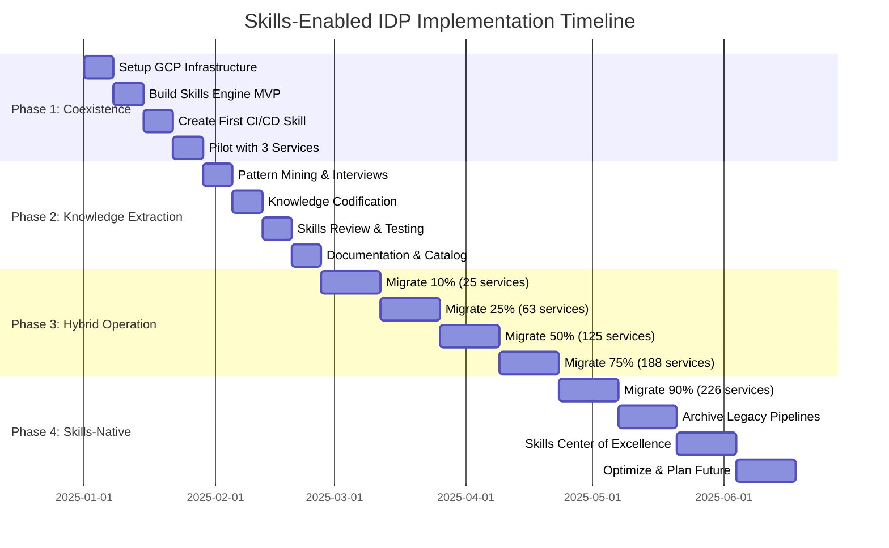
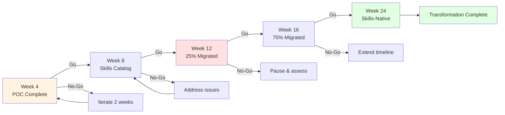

# Migration Phases Timeline

> **24-week implementation roadmap showing all four migration phases**

[← Back to Diagrams Index](README.md) | [← Implementation Guide](../04-IMPLEMENTATION-GUIDE.md)

---

## 24-Week Implementation Timeline

## Phase Breakdown

### Phase 1: Coexistence (Weeks 1-4)
**Goal:** Prove concept with pilot services

**Milestones:**
- Week 1: Infrastructure ready
- Week 2: Skills Engine functional
- Week 3: First Skill created
- Week 4: 3 pilots successful

**Success Criteria:**
- Zero incidents from Skills-generated pipelines
- Developer feedback >4/5
- Pipeline generation <30 seconds

### Phase 2: Knowledge Extraction (Weeks 5-8)
**Goal:** Codify organizational expertise into Skills

**Milestones:**
- Week 5: Pattern analysis complete
- Week 6: 15-20 Skills created
- Week 7: All Skills reviewed
- Week 8: Documentation published

**Success Criteria:**
- Skills cover 80%+ of patterns
- Security review passed
- Training materials ready

### Phase 3: Hybrid Operation (Weeks 9-16)
**Goal:** Progressive migration with safety nets

**Milestones:**
- Week 10: 10% migrated (25 services)
- Week 12: 25% migrated (63 services)
- Week 14: 50% migrated (125 services)
- Week 16: 75% migrated (188 services)

**Success Criteria:**
- <5% rollback rate
- Zero production incidents
- Developer satisfaction >4.5/5

### Phase 4: Skills-Native (Weeks 17-24)
**Goal:** Complete migration and establish governance

**Milestones:**
- Week 18: 90% migrated (226 services)
- Week 20: Legacy archived
- Week 22: Governance established
- Week 24: Optimization complete

**Success Criteria:**
- 90%+ migration complete
- ROI target achieved
- Platform team ticket volume -50%+

---

## Critical Decision Points

---

[← Back to Diagrams Index](README.md) | [← Implementation Guide](../04-IMPLEMENTATION-GUIDE.md)
