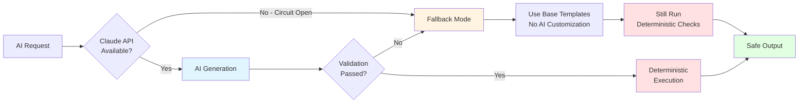

# Hybrid AI-Deterministic Architecture

> **Separation between probabilistic AI reasoning and deterministic code execution with validation gates**

[← Back to Diagrams Index](README.md) | [← Architecture](../02-ARCHITECTURE.md)

---

## The Core Innovation

The breakthrough of Skills-enabled IDPs is combining **flexible AI reasoning** with **reliable deterministic execution**. This diagram shows exactly where the boundary lies and how validation ensures consistent, auditable outputs.

```mermaid
graph TB
    subgraph "Input Layer"
        DevRequest[Developer Request<br/>Natural Language]
        ServiceContext[Service Context<br/>Language, Framework, Dependencies]
        OrgContext[Organizational Context<br/>Standards, Policies, Examples]
    end
    
    subgraph "Probabilistic AI Layer<br/>(Non-Deterministic)"
        IntentParsing[Intent Understanding<br/>What does developer want?]
        ContextAnalysis[Context Analysis<br/>What patterns apply?]
        SkillSelection[Skill Selection<br/>Which Skills are relevant?]
        PatternMatching[Pattern Matching<br/>Which templates fit best?]
        Parameterization[Smart Parameterization<br/>How to configure templates?]
    end
    
    subgraph "Validation Gate<br/>(Trust Boundary)"
        InputValidation{Input Validation<br/>Are parameters safe?}
        SchemaValidation{Schema Validation<br/>Do parameters match schema?}
        PolicyCheck{Policy Pre-Check<br/>Will this pass policies?}
    end
    
    subgraph "Deterministic Code Layer<br/>(Guaranteed Consistent)"
        TemplateEngine[Template Engine<br/>Jinja2/Mustache]
        CodeGeneration[Code Generation<br/>YAML, Terraform, Scripts]
        PolicyValidation[OPA Policy Validation<br/>Security, Compliance Rules]
        SecurityScanning[Security Scanning<br/>Snyk, Trivy, SonarQube]
        IntegrationTests[Integration Tests<br/>Validate Generated Code]
    end
    
    subgraph "Output Gate<br/>(Final Verification)"
        OutputValidation{Output Validation<br/>Is generated code valid?}
        ComplianceCheck{Compliance Check<br/>All policies passed?}
        AuditLog{Audit Trail<br/>Log all decisions}
    end
    
    subgraph "Execution Layer"
        CommitToGit[Commit to Repository]
        TriggerPipeline[Trigger CI/CD Pipeline]
        DeployToEnv[Deploy to Environment]
    end
    
    DevRequest --> IntentParsing
    ServiceContext --> ContextAnalysis
    OrgContext --> ContextAnalysis
    
    IntentParsing --> ContextAnalysis
    ContextAnalysis --> SkillSelection
    SkillSelection --> PatternMatching
    PatternMatching --> Parameterization
    
    Parameterization --> InputValidation
    
    InputValidation -->|Invalid| Reject1[Reject with Error]
    InputValidation -->|Valid| SchemaValidation
    
    SchemaValidation -->|Invalid| Reject2[Reject with Schema Errors]
    SchemaValidation -->|Valid| PolicyCheck
    
    PolicyCheck -->|Likely to Fail| Warn[Warn + Suggest Fixes]
    PolicyCheck -->|Likely to Pass| TemplateEngine
    
    TemplateEngine --> CodeGeneration
    CodeGeneration --> PolicyValidation
    
    PolicyValidation -->|Failed| Reject3[Hard Fail + Remediation]
    PolicyValidation -->|Passed| SecurityScanning
    
    SecurityScanning -->|Critical Issues| Reject4[Hard Fail + Fix Instructions]
    SecurityScanning -->|Passed| IntegrationTests
    
    IntegrationTests -->|Failed| Reject5[Fail + Test Output]
    IntegrationTests -->|Passed| OutputValidation
    
    OutputValidation -->|Invalid| Reject6[Fail + Validation Errors]
    OutputValidation -->|Valid| ComplianceCheck
    
    ComplianceCheck -->|Failed| Reject7[Fail + Compliance Report]
    ComplianceCheck -->|Passed| AuditLog
    
    AuditLog --> CommitToGit
    CommitToGit --> TriggerPipeline
    TriggerPipeline --> DeployToEnv
    
    style IntentParsing fill:#e1f5ff
    style ContextAnalysis fill:#e1f5ff
    style SkillSelection fill:#e1f5ff
    style PatternMatching fill:#e1f5ff
    style Parameterization fill:#e1f5ff
    
    style InputValidation fill:#fff4e1
    style SchemaValidation fill:#fff4e1
    style PolicyCheck fill:#fff4e1
    
    style TemplateEngine fill:#ffe1e1
    style CodeGeneration fill:#ffe1e1
    style PolicyValidation fill:#ffe1e1
    style SecurityScanning fill:#ffe1e1
    style IntegrationTests fill:#ffe1e1
    
    style OutputValidation fill:#f0ffe1
    style ComplianceCheck fill:#f0ffe1
    style AuditLog fill:#f0ffe1
    
    style CommitToGit fill:#e1ffe1
    style DeployToEnv fill:#e1ffe1
```



## Layer-by-Layer Breakdown

### 1. Probabilistic AI Layer (Blue)

**What AI Does:**
- **Intent Understanding**: Parse natural language ("I need a pipeline") into structured intent
- **Context Analysis**: Understand service characteristics (Node.js, payment domain, microservice)
- **Skill Selection**: Choose relevant Skills from catalog (CI/CD, security, deployment)
- **Pattern Matching**: Match service requirements to organizational patterns
- **Parameterization**: Intelligently configure templates (node version, security level, deployment strategy)

**Non-Deterministic Aspects:**
- AI may select different Skills for similar requests (context-dependent)
- Parameterization may vary slightly (within acceptable ranges)
- Explanation text and documentation may differ

**Why This Matters:**
- Flexibility: AI adapts to specific context and nuance
- Intelligence: Can handle ambiguity and partial information
- Learning: Improves over time as patterns evolve

**Documented Behavior:**
```yaml
AI Layer Variance:
  Same Request, Different Times:
    - May select Skills in different order (doesn't affect output)
    - May phrase explanations differently
    - May ask different clarifying questions
    - BUT: Final parameters are functionally equivalent
    
  Acceptable Variance:
    - Node version selection: 18.x vs 20.x (both valid)
    - Test coverage threshold: 80% vs 85% (both acceptable)
    - Deployment strategy: canary vs blue-green (context-dependent)
    
  Unacceptable Variance:
    - Security policies: NEVER varies (deterministic enforcement)
    - Compliance requirements: NEVER varies (policy-driven)
    - Secret handling: NEVER varies (always use Secret Manager)
```

### 2. Validation Gate (Yellow)

**Critical Trust Boundary** - Where AI output is validated before deterministic execution.

**Input Validation:**
```typescript
// Example validation logic
interface ValidationGate {
  validateParameters(params: AIGeneratedParams): ValidationResult {
    // 1. Type checking
    if (typeof params.node_version !== 'string') {
      return { valid: false, error: 'node_version must be string' };
    }
    
    // 2. Range checking
    if (params.test_coverage < 60 || params.test_coverage > 100) {
      return { valid: false, error: 'test_coverage must be 60-100' };
    }
    
    // 3. Enum checking
    const validStrategies = ['rolling', 'blue-green', 'canary'];
    if (!validStrategies.includes(params.deployment_strategy)) {
      return { valid: false, error: 'invalid deployment_strategy' };
    }
    
    // 4. Security checks
    if (params.secrets && params.secrets.some(s => s.hardcoded)) {
      return { valid: false, error: 'hardcoded secrets not allowed' };
    }
    
    return { valid: true };
  }
}
```

**Schema Validation:**
```yaml
# JSON Schema for pipeline parameters
type: object
required:
  - service_name
  - language
  - deployment_target
properties:
  service_name:
    type: string
    pattern: '^[a-z][a-z0-9-]*$'  # kebab-case
    minLength: 3
    maxLength: 63
  
  language:
    type: string
    enum: [nodejs, python, java, go]
  
  node_version:
    type: string
    pattern: '^(18|20|22)\\.x$'  # Only supported versions
  
  deployment_strategy:
    type: string
    enum: [rolling, blue-green, canary]
    default: rolling
  
  environments:
    type: array
    items:
      type: object
      required: [name, cluster]
      properties:
        name: {type: string, enum: [dev, staging, prod]}
        cluster: {type: string}
        auto_deploy: {type: boolean}
```

**Policy Pre-Check:**
```rego
# OPA policy snippet - predictive check
package pipeline.precheck

# Predict if secrets will pass validation
secrets_will_fail[msg] {
  input.secrets[_].source != "secret_manager"
  msg := "Secrets must use Secret Manager"
}

# Predict if security scans are configured
scans_will_fail[msg] {
  not input.security_scans.snyk
  msg := "Snyk scan required for all pipelines"
}

# Predict if production has approvals
approvals_will_fail[msg] {
  env := input.environments[_]
  env.name == "prod"
  not env.approval_required
  msg := "Production deployments require approval"
}

allow {
  count(secrets_will_fail) == 0
  count(scans_will_fail) == 0
  count(approvals_will_fail) == 0
}
```

### 3. Deterministic Code Layer (Red)

**100% Consistent Execution** - Same input always produces same output.

**Template Engine:**
```yaml
# Templates are deterministic code, not AI-generated
# Jinja2 example: templates/cloudbuild-nodejs.yaml.j2

steps:
  # Build step - deterministic
  - name: 'gcr.io/cloud-builders/npm'
    args: ['ci']
    env:
      - 'NODE_VERSION={{ node_version }}'
  
  # Test step - deterministic
  - name: 'gcr.io/cloud-builders/npm'
    args: ['test']
    env:
      - 'COVERAGE_THRESHOLD={{ test_coverage }}'
  
  # Security scan - deterministic
  - name: 'snyk/snyk:node'
    args: ['test', '--severity-threshold=high']
    # ALWAYS runs, no AI decision
  
  # Docker build - deterministic
  - name: 'gcr.io/cloud-builders/docker'
    args: ['build', '-t', 'gcr.io/$PROJECT_ID/{{ service_name }}', '.']
```

**Policy Validation (OPA):**
```rego
# Deterministic policy evaluation
package pipeline.security

# ALWAYS fails if secrets hardcoded
deny[msg] {
  artifact := input.artifacts[_]
  contains(artifact.content, "API_KEY=")
  msg := "Hardcoded API key detected"
}

# ALWAYS fails if no security scans
deny[msg] {
  not input.steps[_].name == "snyk/snyk:node"
  msg := "Snyk security scan missing"
}

# ALWAYS fails if prod has no approval
deny[msg] {
  env := input.environments[_]
  env.name == "prod"
  not env.approval_required
  msg := "Production requires approval gate"
}

# Deterministic result: allow if no deny rules triggered
allow {
  count(deny) == 0
}
```

**Security Scanning:**
```yaml
# Deterministic security checks
Security Scans (Always Run):
  Snyk:
    - Scans: package.json dependencies
    - Threshold: Zero critical vulnerabilities
    - Result: PASS/FAIL (deterministic)
    
  Trivy:
    - Scans: Docker image layers
    - Threshold: Zero high/critical CVEs
    - Result: PASS/FAIL (deterministic)
    
  SonarQube:
    - Scans: Source code (SAST)
    - Threshold: Security rating >= A
    - Result: PASS/FAIL (deterministic)
    
  SBOM Generation:
    - Creates: Software Bill of Materials
    - Format: CycloneDX JSON
    - Always generated (deterministic)
```

### 4. Output Gate (Green)

**Final Verification** - Ensures output meets all requirements before execution.

**Output Validation:**
```typescript
interface OutputValidator {
  // Validate generated YAML is syntactically correct
  validateSyntax(yaml: string): boolean {
    try {
      YAML.parse(yaml);
      return true;
    } catch (e) {
      return false;
    }
  }
  
  // Validate against Cloud Build schema
  validateSchema(config: CloudBuildConfig): boolean {
    // Check required fields present
    if (!config.steps || config.steps.length === 0) {
      return false;
    }
    
    // Check each step has required fields
    for (const step of config.steps) {
      if (!step.name || !step.args) {
        return false;
      }
    }
    
    return true;
  }
  
  // Validate security requirements met
  validateSecurity(config: CloudBuildConfig): boolean {
    // Must have Snyk scan
    const hasSnyk = config.steps.some(s => 
      s.name.includes('snyk')
    );
    
    // Must have Trivy scan
    const hasTrivy = config.steps.some(s => 
      s.name.includes('trivy')
    );
    
    return hasSnyk && hasTrivy;
  }
}
```

**Compliance Check:**
```yaml
Compliance Verification (All Must Pass):
  SOC2 Controls:
    - Access logging enabled: ✓
    - Approval workflows configured: ✓
    - Audit trail captured: ✓
    
  PCI-DSS (if payment service):
    - Encryption in transit: ✓
    - Encryption at rest: ✓
    - Network isolation: ✓
    - No cardholder data in logs: ✓
    
  GDPR (if EU data):
    - Data retention policies: ✓
    - Right to deletion support: ✓
    - Data encryption: ✓
    
  Organization Policies:
    - Naming conventions followed: ✓
    - Resource tagging complete: ✓
    - Cost allocation labels: ✓
```

## Fallback Mechanisms

### When AI Fails



**Fallback Behavior:**

```yaml
Fallback Scenarios:

1. Claude API Completely Unavailable:
   Trigger: Circuit breaker open (5 consecutive failures)
   Action:
     - Switch to template-only generation
     - No AI customization or intelligence
     - Use safest, most conservative templates
     - Still run ALL deterministic validations
     - Alert platform team
   Result:
     - Functional but generic pipelines
     - 100% compliant (deterministic checks still run)
     - Degraded UX (no smart defaults)

2. AI Generates Invalid Parameters:
   Trigger: Validation gate rejects AI output
   Action:
     - Log AI parameters for analysis
     - Fall back to template defaults
     - Prompt developer for clarification
     - Re-run with corrected input
   Result:
     - Developer provides additional context
     - Either AI succeeds on retry or manual input used

3. AI Suggests Non-Compliant Configuration:
   Trigger: Policy pre-check predicts failure
   Action:
     - Warn developer before generation
     - Suggest compliant alternatives
     - Allow override with justification
     - Still enforce deterministic validation
   Result:
     - Developer makes informed choice
     - Non-compliant configs still blocked by OPA

4. Deterministic Validation Fails:
   Trigger: OPA, security scans, or tests fail
   Action:
     - HARD FAIL - no fallback
     - Provide detailed error messages
     - Suggest remediation steps
     - Require manual fix and retry
   Result:
     - No unsafe code ever generated
     - 100% policy compliance maintained
```

## Documented Assumptions

### AI Behavior

```yaml
Non-Deterministic Elements (Acceptable Variance):
  - Skill selection order
  - Parameter value selection (within valid ranges)
  - Explanation text phrasing
  - Clarifying question wording
  - Documentation style

Deterministic Requirements (Zero Variance):
  - Security policy enforcement
  - Compliance checks
  - Secret handling
  - Scan execution
  - Validation logic
  - Template rendering
```

### Validation Guarantees

```yaml
Validation Layers (Defense in Depth):
  1. Input Validation:
     - Type checking
     - Range validation
     - Enum verification
     - SQL injection prevention
     
  2. Schema Validation:
     - JSON Schema compliance
     - Required fields present
     - Field type correctness
     
  3. Policy Pre-Check:
     - Predictive validation
     - Early failure detection
     - Better error messages
     
  4. Template Execution:
     - Deterministic rendering
     - No runtime variance
     - Idempotent operations
     
  5. Policy Validation (OPA):
     - Hard enforcement
     - No exceptions allowed
     - Audit logged
     
  6. Security Scanning:
     - Static analysis
     - Vulnerability detection
     - Dependency checks
     
  7. Integration Tests:
     - Functional validation
     - End-to-end checks
     - Contract verification
     
  8. Output Validation:
     - Syntax verification
     - Schema compliance
     - Final safety check
```

### Trust Boundaries

```yaml
Trust Model:

Layer 1 - AI (Low Trust):
  - Treats AI output as untrusted input
  - NEVER directly executes AI suggestions
  - ALWAYS validates before use
  - Assumes AI can be wrong/malicious

Layer 2 - Validation Gate (Medium Trust):
  - Validates AI output thoroughly
  - Enforces business rules
  - Checks security boundaries
  - Can reject invalid input

Layer 3 - Deterministic Code (High Trust):
  - Code-reviewed templates
  - Version-controlled
  - Thoroughly tested
  - Guaranteed consistent behavior

Layer 4 - Execution (Verified):
  - Only executes validated code
  - Audit trail maintained
  - Rollback capability
  - Monitoring active
```

## Why This Matters

### For Platform Teams

✅ **Confidence**: AI reasoning is flexible, but critical operations are deterministic
✅ **Auditability**: Every decision logged, compliance provable
✅ **Safety**: Multiple validation gates prevent unsafe code
✅ **Fallback**: System degrades gracefully when AI unavailable

### For Developers

✅ **Flexibility**: AI adapts to context and handles ambiguity
✅ **Reliability**: Output is consistent and predictable
✅ **Transparency**: Understand what's AI vs deterministic
✅ **Trust**: Security and compliance never compromised

### For Security/Compliance Teams

✅ **Enforcement**: Policies enforced deterministically, no AI override
✅ **Audit Trail**: Complete record of decisions and validations
✅ **Defense in Depth**: Multiple layers of validation
✅ **Zero Trust**: AI output treated as untrusted input

---

## The Breakthrough

Traditional approaches are either:
- **Pure AI**: Flexible but unreliable, not auditable
- **Pure Templates**: Reliable but inflexible, requires expertise

**Skills-enabled IDPs combine the best of both:**
- AI provides intelligence and adaptability
- Deterministic code ensures reliability and auditability
- Validation gates create trust boundaries
- Fallback mechanisms guarantee availability

**This is why Skills-enabled IDPs can be trusted in production.**

---

[← Back to Diagrams Index](README.md) | [← Architecture](../02-ARCHITECTURE.md)
