# Developer Workflows: Before vs After

> **Side-by-side comparison showing the dramatic improvement in developer experience with Skills-enabled IDPs**

[← Back to Diagrams Index](README.md) | [← Architecture](../02-ARCHITECTURE.md)

---

## Scenario: Launching a New Microservice

Real-world example: Backend team needs to create a new payment processing API service with CI/CD pipeline, infrastructure, and deployment to GKE.

### Before Skills-Enabled IDP

```mermaid
gantt
    title Before: Manual Process (5 days, 23 hours)
    dateFormat HH:mm
    axisFormat %H:%M
    
    section Day 1
    Find template                    :done, 00:00, 30m
    Read wiki pages                  :done, 00:30, 1h
    Customize template               :done, 01:30, 3h
    Submit for platform review       :done, 04:30, 30m
    Wait for platform team           :crit, 05:00, 3h
    Platform identifies 15 issues    :crit, 08:00, 0m
    Fix issues                       :done, 08:00, 2h
    Resubmit                         :done, 10:00, 30m
    
    section Day 2
    Create CI/CD pipeline            :done, 00:00, 1h
    Discover missing security scans  :crit, 01:00, 30m
    Find docs on scans               :done, 01:30, 2h
    Pipeline fails                   :crit, 03:30, 30m
    Get help from platform team      :crit, 04:00, 1h
    Add compliance gates             :done, 05:00, 1h
    
    section Day 3
    Start writing app code           :done, 00:00, 2h
    Realize tests needed             :crit, 02:00, 30m
    Search for test patterns         :done, 02:30, 1h
    Tests fail (deps)                :crit, 03:30, 30m
    
    section Day 4
    Get help on mocking              :crit, 00:00, 1h
    Rewrite tests                    :done, 01:00, 1h30m
    Create basic README              :done, 02:30, 30m
    
    section Day 5
    Code review feedback             :crit, 00:00, 0m
    Fix standards violations         :done, 00:00, 1h
    Update documentation             :done, 01:00, 1h
```



#### Day-by-Day Breakdown

**Day 1: Infrastructure Setup (8 hours)**
```
08:00 - 08:30  Find infrastructure template in Confluence
               Problem: 15 different templates, which one?
               
08:30 - 09:30  Read wiki pages about standards
               - Naming conventions
               - Networking requirements
               - Security policies
               - All scattered across different pages
               
09:30 - 12:30  Customize Terraform template
               - Change resource names
               - Update network config
               - Add required tags
               - Set up Cloud SQL
               - Make 23 changes, uncertain about 12 of them
               
12:30 - 13:00  Submit for platform team review
               Create ticket, wait for assignment
               
13:00 - 16:00  ⏳ BLOCKED: Waiting for platform team
               Platform team in meetings, backlog of 8 tickets
               
16:00          Platform team reviews, identifies 15 issues:
               ❌ Wrong naming convention
               ❌ Missing required tags
               ❌ Incorrect network setup
               ❌ No monitoring configured
               ❌ Security group too permissive
               ... and 10 more
               
16:00 - 18:00  Fix all 15 issues
               Some require re-reading documentation
               
18:00 - 18:30  Resubmit, wait overnight for approval

❌ Pain Points:
- Scattered documentation
- Trial and error approach
- Platform team bottleneck
- Multiple review cycles
- High frustration
```

**Day 2: CI/CD Pipeline (6 hours)**
```
08:00 - 09:00  Copy Jenkins shared library example
               Modify for Node.js service
               
09:00 - 09:30  First pipeline run FAILS
               ❌ Missing Snyk security scan
               Error: "Required scan not found"
               
09:30 - 11:30  Find documentation on security scans
               - Read security wiki
               - Find Snyk plugin docs
               - Add to pipeline
               - Configure thresholds
               
11:30 - 12:00  Pipeline runs, FAILS again
               ❌ SonarQube not configured
               
12:00 - 13:00  Slack platform team for help
               ⏳ Wait 30 minutes for response
               Get instructions, implement
               
13:00 - 14:00  Add missing compliance gates
               - Production approval workflow
               - Staging deployment
               - Rollback procedures

❌ Pain Points:
- Multiple pipeline failures
- Incomplete documentation
- Platform team dependency
- Security requirements unclear
- Time-consuming trial & error
```

**Day 3: Application Code & Tests (4 hours)**
```
08:00 - 10:00  Write application code
               Finally able to do actual work!
               
10:00 - 10:30  Code review mentions need for tests
               "Where are the tests?"
               
10:30 - 11:30  Search for testing patterns
               - Find 3 different approaches
               - Unclear which is "blessed"
               - Pick one, hope for the best
               
11:30 - 12:00  Write basic tests
               No mocking, direct dependencies
               
12:00          Tests FAIL in CI
               ❌ Can't connect to external services
               External APIs not available in test env

❌ Pain Points:
- Testing standards unclear
- Mocking patterns unknown
- Test environment issues
- No example to follow
```

**Day 4: Test Improvements & Documentation (3 hours)**
```
08:00 - 09:00  Ask senior dev for help with mocking
               ⏳ Wait for senior dev availability
               Learn proper mocking patterns
               
09:00 - 10:30  Rewrite tests with mocks
               - Add test utilities
               - Create test data builders
               - Fix test environment config
               
10:30 - 11:00  Create README
               Basic info only, missing sections

❌ Pain Points:
- Senior developer bottleneck
- Rework due to lack of guidance
- Documentation incomplete
```

**Day 5: Code Review & Fixes (2 hours)**
```
08:00          Code review feedback arrives
               8 standards violations found:
               ❌ Inconsistent error handling
               ❌ Missing input validation
               ❌ Logs don't follow format
               ❌ No structured logging
               ❌ Missing health check endpoint
               ❌ No metrics endpoint
               ❌ Documentation incomplete
               ❌ Missing runbook
               
08:00 - 09:00  Fix all violations
               
09:00 - 10:00  Update documentation
               Add missing sections to README
               Create basic runbook

❌ Pain Points:
- Standards learned through rejection
- Rework instead of doing it right first
- Wasted time in review cycles
```

**Total Time: 23 hours over 5 days**
- **Actual coding**: 6 hours (26%)
- **Finding information**: 7 hours (30%)
- **Fixing issues**: 6 hours (26%)
- **Waiting/blocked**: 4 hours (17%)

**External Dependencies:**
- Platform team consulted: 3 times
- Senior developer help: 1 time
- Review cycles: 3 rounds

**Quality Issues:**
- Standards violations: 23 issues total
- Security issues found: 3
- Pipeline runs to success: 4 attempts

---

### After Skills-Enabled IDP


#### Complete Workflow (3 hours)

**08:00 - 08:15: Infrastructure Generation (15 minutes)**
```
Developer in VS Code with Cline:

> "Create infrastructure for a new payment processing API service"

Cline (with Skills): "I'll set up infrastructure for your payment service. 
Payment services typically require enhanced security. Let me confirm:

1. Node.js 20.x? (from your workspace)
2. High security tier (PCI-compliant)?
3. Deploy to production GKE cluster?
4. Need Cloud SQL for transactions?
5. Standard payment service monitoring?"

Developer: "Yes to all"

Cline: "Generating infrastructure..."

[15 minutes later]

✅ Created:
- terraform/
  ├── main.tf (Cloud SQL, Secret Manager, VPC)
  ├── variables.tf
  ├── outputs.tf
- kubernetes/
  ├── deployment.yaml (with security context)
  ├── service.yaml
  ├── hpa.yaml
  ├── network-policy.yaml (PCI isolation)

All following org standards:
✓ Naming conventions applied
✓ Required tags added
✓ Network isolation configured
✓ Monitoring enabled
✓ Secrets in Secret Manager
✓ PCI-compliant setup
```

**08:15 - 08:30: CI/CD Pipeline Generation (15 minutes)**
```
Developer:

> "Create CI/CD pipeline for this service"

Cline (with gcp-nodejs-cicd Skill):

"Creating pipeline for payment-api. Detected:
- Node.js 20.x
- Payment domain (high security)
- GKE deployment target

Including:
- Enhanced security scanning (payment service)
- PCI compliance checks
- Canary deployment (recommended for payments)
- Production approval gates

Generating..."

✅ Created:
- .cloudbuild/
  ├── cloudbuild.yaml
      └── Build steps:
          - npm ci
          - npm test (coverage 80%+)
          - Snyk scan (0 critical CVEs)
          - Trivy scan (container)
          - SonarQube (security A rating)
          - SBOM generation
          - Docker build
          - Push to Artifact Registry
          - Deploy to dev (auto)
          - Deploy to staging (manual approve)
          - Canary deploy to prod (traffic: 5%→50%→100%)
          - Health check validation
          - Auto rollback on errors

All required scans included ✓
All compliance gates configured ✓
Approval workflows set up ✓
```

**08:30 - 08:50: Testing Framework Setup (20 minutes)**
```
Developer:

> "Set up testing framework following our standards"

Cline (with testing Skill):

"Setting up testing for payment-api with org standards:
- Jest (matches your other services)
- Test data builders
- API mocking patterns
- Integration test setup
- Coverage reporting (80% minimum)

Generating..."

✅ Created:
- tests/
  ├── unit/
  │   └── payment.test.ts
  ├── integration/
  │   └── api.test.ts
  ├── helpers/
  │   ├── builders.ts (test data)
  │   └── mocks.ts (API mocks)
  └── setup.ts

- package.json updated:
  - jest configured
  - coverage thresholds
  - test scripts

✅ Example tests generated following org patterns
✅ Mock patterns match senior dev best practices
✅ Test data builders included
```

**08:50 - 09:20: Review Generated Code (30 minutes)**
```
Developer reviews all generated code:

✓ Infrastructure looks correct
✓ Pipeline has all required scans
✓ Tests follow patterns
✓ Everything matches org standards

Minor customization:
- Adjust Cloud SQL size
- Add one custom environment variable
- Modify HPA settings

Total customization: 3 files, 10 lines
```

**09:20 - 10:50: Write Application Logic (1.5 hours)**
```
Developer can FINALLY focus on actual coding:

- Implement payment API endpoints
- Business logic
- Error handling
- Logging (following org format automatically)
- Metrics (standard metrics auto-configured)

Cline assists with:
- Code completion using org patterns
- Automatic logging format
- Error handling patterns
- Input validation examples

🎯 Developer spends time on business value, not setup
```

**10:50 - 11:10: Documentation Generation (20 minutes)**
```
Developer:

> "Generate complete documentation"

Cline (with docs Skill):

"Creating documentation suite for payment-api..."

✅ Created:
- README.md
  - Service overview
  - Architecture diagram (Mermaid)
  - Getting started
  - API endpoints
  - Environment variables
  - Deployment
  - Troubleshooting

- docs/
  ├── API.md (OpenAPI spec)
  ├── RUNBOOK.md
  │   ├── Deployment procedures
  │   ├── Rollback steps
  │   ├── Common issues
  │   └── On-call procedures
  └── ARCHITECTURE.md
      ├── System design
      ├── Component diagram
      ├── Dependencies
      └── Decision records

All following org templates ✓
All required sections present ✓
```

**11:10: Commit & Push**
```
Developer:

$ git add .
$ git commit -m "Initial payment-api setup"
$ git push

Cloud Build triggers automatically:
✅ All tests pass (first try)
✅ All security scans pass
✅ All policy checks pass
✅ Deployed to dev environment

Service is running in dev ✓
```

**Total Time: 3 hours, same day**
- **Actual coding**: 1.5 hours (50%)
- **Setup/config**: 1 hour (33%)
- **Review**: 0.5 hours (17%)
- **Waiting/blocked**: 0 minutes (0%)

**External Dependencies:**
- Platform team: 0 consultations
- Senior developer: 0 consultations
- Review cycles: 0 (pre-validated)

**Quality Issues:**
- Standards violations: 0
- Security issues: 0
- Pipeline runs to success: 1 (first try)

---

## Side-by-Side Comparison


### Metrics Comparison

| Metric | Before Skills | After Skills | Improvement |
|--------|---------------|--------------|-------------|
| **Total Time** | 23 hours | 3 hours | **87% reduction** |
| **Calendar Days** | 5 days | Same day | **5x faster** |
| **Coding Time %** | 26% | 50% | **2x more coding** |
| **Platform Team Interactions** | 3 | 0 | **100% reduction** |
| **Standards Violations** | 23 | 0 | **100% reduction** |
| **Security Issues** | 3 | 0 | **100% reduction** |
| **Pipeline Attempts** | 4 | 1 | **75% reduction** |
| **Documentation Complete** | 40% | 100% | **60% improvement** |
| **Developer Frustration** | High | Low | **Significant** |

### Where Time Goes

**Before Skills:**
```
Finding Information     30% ████████████
Fixing Issues          26% ██████████
Actual Coding          26% ██████████
Waiting/Blocked        17% ███████
```

**After Skills:**
```
Actual Coding          50% ████████████████████
Setup/Configuration    33% █████████████
Review                 17% ███████
Waiting/Blocked         0% 
```

---

## Multiple Personas

### Junior Developer Experience

**Before Skills:**
```
Junior Dev (Day 1):
"I have no idea which template to use..."
"What do all these fields mean?"
"I'll just copy what I see in other repos..."
[Creates 15 issues in platform team review]

Junior Dev (Day 3):
"Why did my pipeline fail?"
"I don't understand this error..."
"Can someone help me?"
[Blocks senior dev for 2 hours]

Junior Dev (Day 5):
"I thought I did it right..."
"How was I supposed to know that?"
[8 issues in code review]
```

**After Skills:**
```
Junior Dev (Hour 1):
"Create infrastructure for my API service"
[Cline generates everything correctly]

Junior Dev (Hour 2):
"This looks right! Time to write code."
[Focuses on business logic]

Junior Dev (Hour 3):
"Everything passed! I'm done!"
[Ships production-ready code]

💡 Junior dev performs like senior dev
```

### Senior Developer Experience

**Before Skills:**
```
Senior Dev Interruptions:
09:00 - Junior dev needs help with testing (30 min)
10:30 - Platform team asks about architecture (45 min)
13:00 - Code review for 3 services (1 hour)
15:00 - Help with pipeline issues (30 min)

Actual work time: 4 hours (50% of day)
```

**After Skills:**
```
Senior Dev Day:
08:00 - Generate new service setup (15 min)
08:15 - Focus on complex algorithm (6 hours)
14:15 - Quick reviews (1 hour)
15:15 - Mentor on architecture (1 hour)

Actual work time: 7 hours (87% of day)
Interruptions: Minimal

💡 Senior devs focus on high-value work
```

### Platform Team Experience

**Before Skills:**
```
Platform Team Tickets:
- 120 support tickets/month
- 40% of time answering same questions
- 30% reviewing configs for standards
- Constant interruptions
- Can't work on platform improvements

Backlog: 2-3 week wait for non-urgent
```

**After Skills:**
```
Platform Team:
- 45 support tickets/month (-62%)
- Tickets are actual edge cases
- Time for platform improvements
- Can focus on innovation

Backlog: Same-day for most requests

💡 Platform team can scale
```

---

## ROI Calculation

### Per Developer, Per Service

**Time Saved:**
- Before: 23 hours
- After: 3 hours
- Saved: 20 hours × $100/hour = **$2,000 per service**

**Quality Improvement:**
- Standards violations: -23 issues
- Security issues: -3 issues
- Review cycles: -2 iterations
- Value: **$500 in avoided rework**

**Total per service:** **$2,500 value**

### Organization-Wide (Annual)

**Assumptions:**
- 250 developers
- Each creates 4 new services/year
- 1,000 new services annually

**Annual Value:**
- Time savings: 1,000 services × $2,000 = **$2,000,000**
- Quality improvements: 1,000 × $500 = **$500,000**
- Platform team efficiency: **$500,000**

**Total Annual Value: $3,000,000**

**Implementation Cost:**
- Year 1: $500,000
- Ongoing: $200,000/year

**ROI Year 1: 500%**

---

## Documented Assumptions

### Time Estimates

```yaml
Manual Process (Before):
  Infrastructure Setup:
    - Template finding: 30 min
    - Documentation reading: 1-2 hours
    - Customization: 3-4 hours
    - Review cycles: 2-3 hours
    Total: 6-8 hours

  Pipeline Creation:
    - Copy/modify: 1-2 hours
    - Fix failures: 2-3 hours
    - Add missing pieces: 2-3 hours
    Total: 5-8 hours

  Testing Setup:
    - Find patterns: 1-2 hours
    - Initial implementation: 1-2 hours
    - Fix issues: 2-3 hours
    Total: 4-7 hours

  Documentation:
    - Basic README: 30-60 min
    - Fixes after review: 1-2 hours
    Total: 1.5-3 hours

Skills-Enabled Process (After):
  Infrastructure: 15-20 min (AI generation)
  Pipeline: 10-15 min (AI generation)
  Testing: 15-20 min (AI generation)
  Review: 30-45 min (validation)
  Application Code: 1-2 hours (actual work)
  Documentation: 15-20 min (AI generation)
  Total: 2.5-3.5 hours
```

### Developer Hourly Rate

```yaml
Calculation Basis:
  Average Developer Salary: $150,000/year
  Fully-loaded Cost: $200,000/year
  Working Hours: 2,000/year
  Effective Rate: $100/hour

Conservative Estimate:
  Using $100/hour understates actual cost
  Real cost includes overhead, benefits, etc.
```

### Service Creation Frequency

```yaml
New Services Per Year:
  Small org (50 devs): 100-200 services
  Medium org (250 devs): 500-1000 services
  Large org (1000 devs): 2000-5000 services

Our Calculation:
  250 developers
  4 services per developer per year
  1,000 total new services
  Conservative estimate
```

---

## Why This Matters

### For Developers

✅ **Focus on value** - 50% of time on actual coding vs 26%
✅ **Ship faster** - Same day vs 5 days
✅ **Learn faster** - Best practices embedded, not learned through rejection
✅ **Less frustration** - Zero blocked time, zero review rework

### For Organizations

✅ **Velocity** - 5x faster time to production
✅ **Quality** - Zero standards violations, zero security issues
✅ **Scalability** - Platform team can support 5x more developers
✅ **Cost** - $2,500 value per service, $3M annual value

### For Platform Teams

✅ **Efficiency** - 62% reduction in support tickets
✅ **Focus** - Time for innovation vs fire-fighting
✅ **Standards** - Enforced automatically, not manually
✅ **Scalability** - Support grows sub-linearly with developer count

---

**This is why Skills-enabled IDPs transform developer productivity.**

---

[← Back to Diagrams Index](README.md) | [← Architecture](../02-ARCHITECTURE.md)
